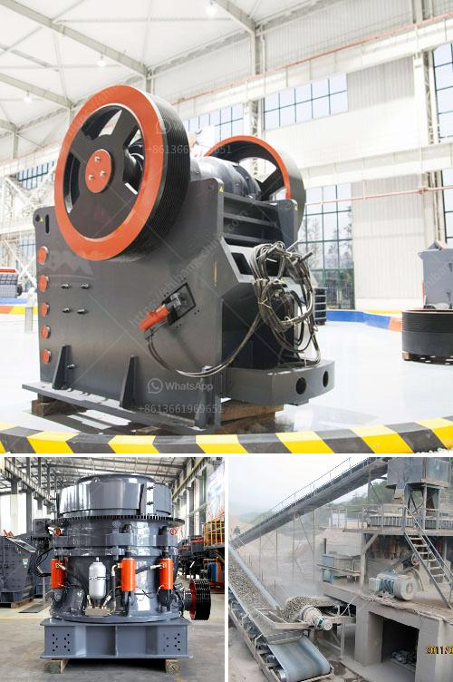

<h3>crushing plant turkey</h3>
Turkey is renowned for its rich history and diverse culture, but it is also a major player in the mining industry. As one of the top aggregates producers in the world, Turkey has embraced modern mining practices to ensure the steady supply of minerals for both domestic and international markets. A crucial component of their mining operation is the crushing plant.

A crushing plant is an essential machinery in mining operations to break down large ore bodies into smaller, more manageable chunks. This process involves a series of heavy-duty machines that reduce the size of materials such as rock, concrete, and other minerals. The crushed materials are then utilized for various applications in construction, road building, and infrastructure development.

Turkey boasts a significant number of crushing plants strategically located across its vast and mineral-rich territory. These plants are typically equipped with state-of-the-art technology and machinery, ensuring high productivity and efficiency. Moreover, Turkey’s favorable geographical location allows for easy access to both European and Asian markets, making it an ideal hub for mineral exports.

The Turkish crushing plant industry has witnessed steady growth over the years, driven by factors such as increased infrastructure investment, urbanization, and demand for aggregates. The sector has also benefited from government initiatives aimed at promoting mining activities and attracting foreign investment. Consequently, numerous international companies have established their presence in Turkey, contributing to the growth and development of the industry.

Furthermore, crushing plant manufacturers in Turkey are renowned for their high-quality equipment, competitive pricing, and commitment to customer satisfaction. With a focus on innovation and technological advancements, these manufacturers continuously improve their products to meet the evolving needs of the mining industry.

In conclusion, crushing plants play a crucial role in Turkey's mining industry. As a top aggregates producer, Turkey has established itself as a key player in the global market. With its favorable geographical location, state-of-the-art machinery, and competitive manufacturers, Turkey's crushing plant industry is poised to continue its growth and contribute significantly to the country's economy.
<h3>Contact us</h3><ul><li><strong>Whatsapp:&nbsp;<a href="https://wa.me/8613661969651">+8613661969651</a></strong></li><li><a href="https://swt.shibang-china.com/?git&amp;zhl&amp;crushing plant turkey"><strong>Online Service(chat now)</strong></a></li></ul><h3>Related</h3><ul><li><a href='business plan for gold mining company in zimbabwe.md'>business plan for gold mining company in zimbabwe</a></li><li><a href='dolomite powder making machine for processing line.md'>dolomite powder making machine for processing line</a></li><li><a href='china roller mill kenya.md'>china roller mill kenya</a></li><li><a href='aggregate roller crushing mill malaysia.md'>aggregate roller crushing mill malaysia</a></li><li><a href='gold processing leaching plant.md'>gold processing leaching plant</a></li></ul>