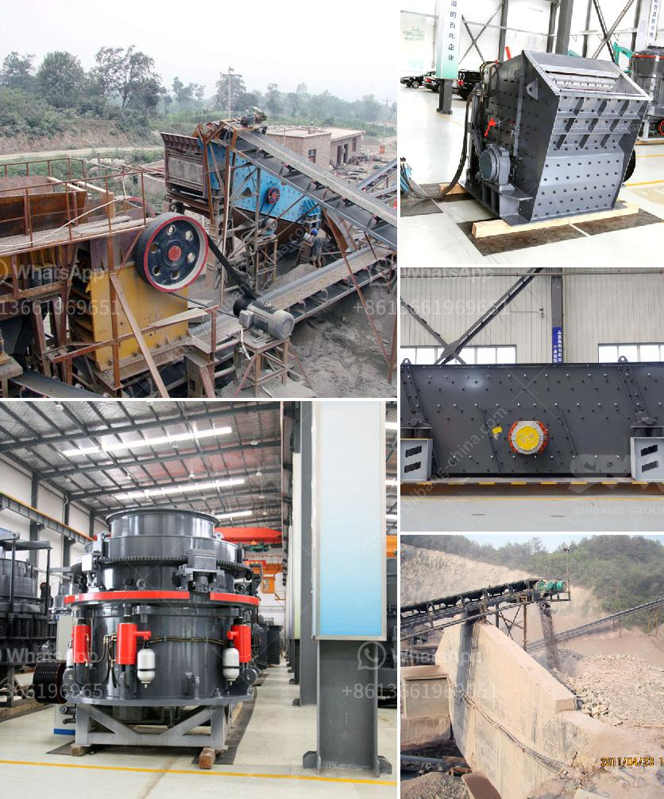

<h3>crushing plants suppliers sales in nigeria</h3>
Nigeria, a country located in West Africa, is known for its diverse ecosystems, landmarks, and abundant resources. The country's development is heavily reliant on the mining and construction sectors, which contribute significantly to its economy. In recent years, there has been a notable increase in the demand for crushing plants in Nigeria due to the rapid growth of these industries.

Crushing plants are vital equipment in mining and construction operations as they help to transform large-sized materials into smaller granules or manageable sizes for various uses. These plants are capable of processing different types of raw materials such as rocks, minerals, and stones, making them essential for infrastructure development.

Suppliers of crushing plants in Nigeria have seen a significant boost in their sales as the demand for these plants has surged. The increase in construction projects, road building, and mining activities has created a need for high-quality crushing plants that can efficiently process large quantities of raw materials. As a result, crushing plants suppliers have been working tirelessly to meet this growing demand.

One reason behind the success of crushing plants suppliers in Nigeria is their ability to provide customized solutions to their clients. Each project has unique requirements and challenges, and suppliers in Nigeria have understood the importance of tailoring their products to meet these specific needs. By offering personalized solutions, they have gained the trust and loyalty of their customers, further enhancing their sales.

Moreover, suppliers have also focused on providing cost-effective solutions without compromising on quality. Nigeria is a developing country where budget constraints are common. Crushing plants suppliers have been proactive in offering affordable options that meet the required standards and regulations. This has made their products accessible to a wider customer base, resulting in increased sales.

In conclusion, the crushing plants suppliers in Nigeria have experienced a remarkable surge in their sales due to the growing demand in the mining and construction sectors. By offering customized solutions and cost-effective options, these suppliers have successfully catered to the needs of various projects and gained a competitive edge in the market. As Nigeria continues to witness economic growth, the demand for crushing plants is expected to further rise, opening up more opportunities for suppliers in the country.
<h3>Contact us</h3><ul><li><strong>Whatsapp:&nbsp;<a href="https://wa.me/8613661969651">+8613661969651</a></strong></li><li><a href="https://swt.shibang-china.com/?git&amp;zhl&amp;crushing plants suppliers sales in nigeria"><strong>Online Service(chat now)</strong></a></li></ul><h3>Related</h3><ul><li><a href='copper ore machine in china.md'>copper ore machine in china</a></li><li><a href='ton per jam jaw crusher.md'>ton per jam jaw crusher</a></li><li><a href='quarry equipment leasing companies in nigeria.md'>quarry equipment leasing companies in nigeria</a></li><li><a href='project proposal on funding gold mining.md'>project proposal on funding gold mining</a></li><li><a href='ball mills for mining in china.md'>ball mills for mining in china</a></li></ul>