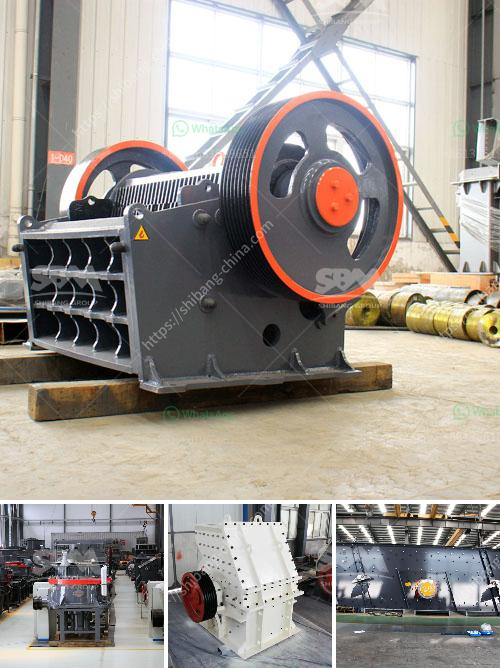

<h3>crushing production line manufacturer</h3>
Crushing production lines play a crucial role in various industries, enabling the efficient processing of raw materials and enhancing overall production capacity. These lines comprise a range of cutting-edge machinery and equipment, and the expertise of crushing production line manufacturers is vital in ensuring optimal performance. In this article, we will explore the significance of crushing production line manufacturers and discuss their capabilities in delivering high-quality production lines tailored to industry-specific needs.

Modern crushing production lines are distinguished by their technologically advanced machinery and equipment. By implementing cutting-edge technologies, manufacturers can design lines that significantly improve the efficiency and productivity of industrial operations. Advanced features such as automated control systems, real-time monitoring, and intelligent maintenance management allow for streamlined and efficient manufacturing processes. Crushing production line manufacturers are continuously innovating and upgrading their equipment to provide industries with state-of-the-art technologies that align with the evolving demands of today's industrial landscape.

Crushing production line manufacturers understand that different industries have unique requirements. They have the expertise to tailor production lines to specific industry needs, which further enhances overall operational efficiency. Manufacturers collaborate closely with clients, analyzing their workflows, and identifying bottlenecks to create the most effective and efficient production line solutions. By crafting customized production lines, manufacturers can optimize the processing of raw materials while ensuring maximum output. Such personalized solutions also empower industries to meet quality and regulatory standards, reducing the risk of non-compliance and associated costs.

Crushing production line manufacturers prioritize quality assurance throughout the manufacturing process. By adhering to quality control protocols and utilizing quality materials, they ensure that the production lines are robust, reliable, and durable. These manufacturers also offer comprehensive after-sales support, including inspections, maintenance, and prompt technical assistance. This commitment to after-sales service ensures that industries can achieve uninterrupted operation and minimize downtime. Additionally, with regular maintenance and upgrades, manufacturers extend the lifespan of production lines, reducing the need for frequent replacements and optimizing return on investment for industrial enterprises.

Crushing production line manufacturers play a pivotal role in driving industrial efficiency across various sectors. By harnessing the potential of cutting-edge technologies and delivering customized solutions, these manufacturers enhance production capacity and optimize operational efficiency. Their commitment to quality assurance and after-sales support further ensures the reliability and durability of production lines, enabling industries to meet their production targets consistently. As industries continue to evolve, crushing production line manufacturers will remain at the forefront, continuously innovating to deliver high-performance solutions that cater to evolving demands and maximize productivity in the industrial landscape.
<h3>Contact us</h3><ul><li><strong>Whatsapp:&nbsp;<a href="https://wa.me/8613661969651">+8613661969651</a></strong></li><li><a href="https://swt.shibang-china.com/?git&amp;zhl&amp;crushing production line manufacturer"><strong>Online Service(chat now)</strong></a></li></ul><h3>Related</h3><ul><li><a href='screen for iron ore pellets.md'>screen for iron ore pellets</a></li><li><a href='stone crushing process.md'>stone crushing process</a></li><li><a href='talc powder grinding mills in german.md'>talc powder grinding mills in german</a></li><li><a href='cement clinker manufacturing plant.md'>cement clinker manufacturing plant</a></li><li><a href='stone crusher mini.md'>stone crusher mini</a></li></ul>