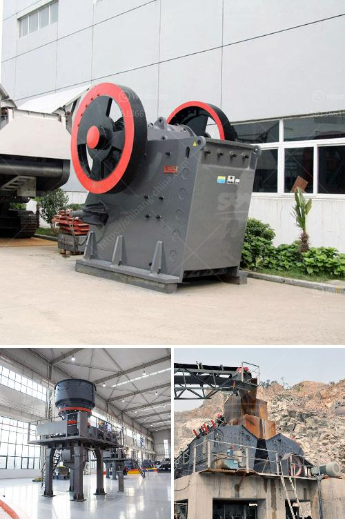

<h3>crushing stones for gold</h3>
Crushing stones for gold is a common practice in many countries. For centuries, people have used grindstones to grind and crush rocks containing gold. In ancient times, miners used primitive tools, such as chisels and hammers, to extract gold nuggets manually. Today, mechanized equipment has made the process more efficient and less labor-intensive.

The first step in extracting gold from rocks is crushing the rocks into smaller pieces. This is done either manually, using a hammer or manually operated stone crusher, or by mechanical means, such as jaw crushers, stamping mills, or ball mills. The smaller pieces are then ground into a fine powder to increase the surface area, facilitating the separation of gold particles from the rest of the material.

Crushers are machines specifically designed to break down stones into smaller sizes. They consist of a fixed plate and a moving plate, with a gap in between. The stones are fed into the gap and crushed as the moving plate moves towards the fixed plate. The size of the crushed material depends on the gap width, which can be adjusted.

Gold has a characteristic yellow color, making it easy to identify. However, it is often found in small particles embedded in rocks or soil. Hence, crushing the stones is a crucial step in the gold extraction process. Once the gold-containing rocks are crushed into a fine powder, various methods, such as panning, sluicing, or using chemical solutions, are employed to separate the gold from the remaining material.

Crushing stones for gold has been a traditional method for miners looking to extract this precious metal. Modern technology and machinery have expedited the process, making it more efficient and productive. Whether using manual tools or mechanized equipment, the goal remains the same: to extract this sought-after commodity from its rocky source.
<h3>Contact us</h3><ul><li><strong>Whatsapp:&nbsp;<a href="https://wa.me/8613661969651">+8613661969651</a></strong></li><li><a href="https://swt.shibang-china.com/?git&amp;zhl&amp;crushing stones for gold"><strong>Online Service(chat now)</strong></a></li></ul><h3>Related</h3><ul><li><a href='crusher machine made in england.md'>crusher machine made in england</a></li><li><a href='turkey jaw crushers in istanbul.md'>turkey jaw crushers in istanbul</a></li><li><a href='prices of hammer mill in zimbabwe.md'>prices of hammer mill in zimbabwe</a></li><li><a href='which roller stand in milling industry.md'>which roller stand in milling industry</a></li><li><a href='rock crusher plant for sale.md'>rock crusher plant for sale</a></li></ul>