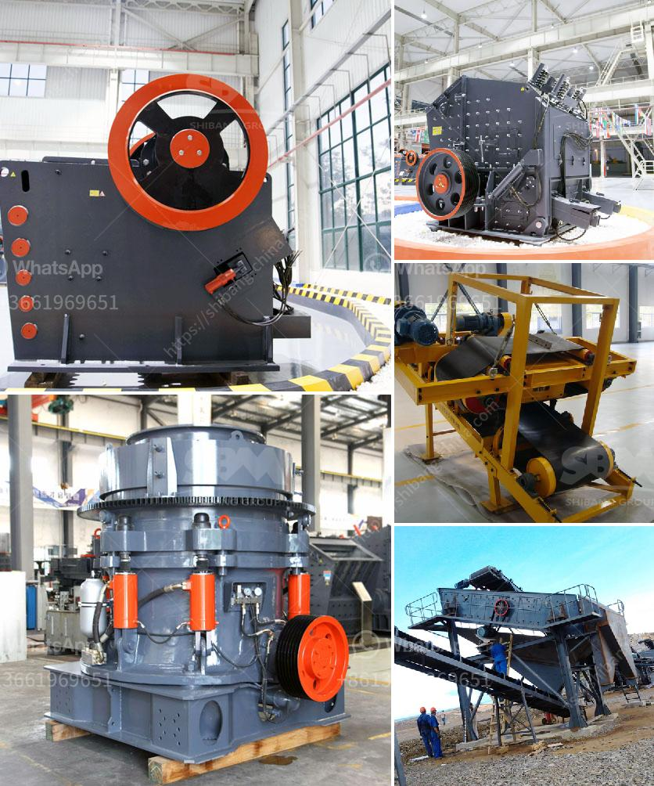

<h3>dealers of grinding mills in uganda</h3>
Uganda, located in East Africa, is renowned for agricultural productivity and an abundance of natural resources. Agriculture has been the backbone of Uganda's economy for many years, with a majority of its population engaged in farming activities. To enhance productivity and maximize the potential of their agricultural produce, farmers rely heavily on efficient grinding mills. These machines are essential in grinding grains into flour or groundnut into paste, among other uses. Therefore, the role of grinding mill dealers in Uganda cannot be overstated.

Grinding mill dealers in Uganda come in different shapes and sizes. Some operate locally, while others have a nationwide presence. These dealers are equipped with various types of grinding mills suitable for different agricultural needs. They offer a diverse range of machines, including hammer mills, grinding plates, and the more modern roller mills.

One prominent grinding mill dealer in Uganda is Muharata Enterprises Ltd. They offer services such as installation, training, and maintenance on their grinding mills. Other reputable dealers in the country include Quadro Kenya Ltd. and Honeywell Flour. These dealers have made a name for themselves by providing reliable and high-quality grinding mills.

The demand for grinding mills in Uganda is growing, driven by an increase in agricultural activities and the need to boost food production. As a result, many grinding mill dealers have sprung up to cater to this demand. These dealers play a vital role in meeting the needs of farmers, both large-scale and small-scale, across the country.

One of the challenges faced by grinding mill dealers in Uganda is the sourcing of spare parts. Grinding mills consist of numerous components that require regular maintenance and replacement. These dealers must establish strong supply chains to ensure their customers can access spare parts quickly and efficiently.

Another challenge is the need for constant innovation. As technology advances, so do the requirements of the agricultural sector. Grinding mill dealers must stay up to date with the latest trends and invest in modern machinery that meets the evolving needs of farmers. This includes incorporating energy-efficient technologies and designing mills that can handle various grains and produce different textures or consistencies.

To overcome these challenges, grinding mill dealers often collaborate with manufacturers and suppliers both locally and internationally. This enables them to source high-quality grinding mills at competitive prices and stay ahead of the market.

In conclusion, grinding mill dealers in Uganda play a critical role in supporting agricultural productivity and food security in the country. Through their comprehensive range of grinding mills, installation services, spare parts availability, and continuous innovation, these dealers contribute to the growth of the agricultural sector and improve the livelihoods of farmers. As Uganda continues to focus on agricultural development, the demand for grinding mills will likely increase, placing grinding mill dealers at the forefront of the country's progress.
<h3>Contact us</h3><ul><li><strong>Whatsapp:&nbsp;<a href="https://wa.me/8613661969651">+8613661969651</a></strong></li><li><a href="https://swt.shibang-china.com/?git&amp;zhl&amp;dealers of grinding mills in uganda"><strong>Online Service(chat now)</strong></a></li></ul><h3>Related</h3><ul><li><a href='quartz stone making machine.md'>quartz stone making machine</a></li><li><a href='impact crusher turkey.md'>impact crusher turkey</a></li><li><a href='conveyor belting manufacturers.md'>conveyor belting manufacturers</a></li><li><a href='cde sand washing plant price.md'>cde sand washing plant price</a></li><li><a href='stone crusher pricetonnes capacity per hour.md'>stone crusher pricetonnes capacity per hour</a></li></ul>