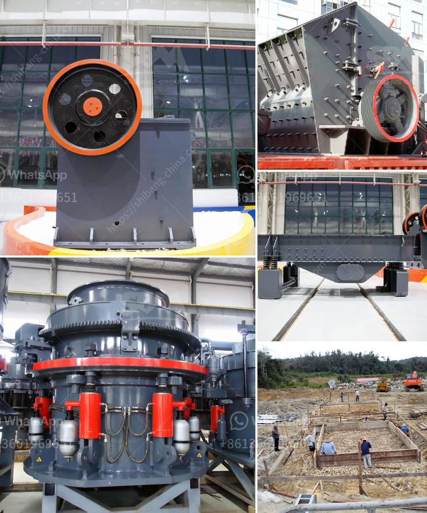

<h3>definivion jaw crusher</h3>
A jaw crusher is one of the main types of primary crushers in a mine or ore processing plant. The size of a jaw crusher is designated by the rectangular or square opening at the top of the jaws (feed opening). For instance, a 24 x 36 jaw crusher has a opening of 24" by 36", a 56 x 56 jaw crusher has a opening of 56" square. 

The jaw crusher consists of two jaws, one fixed and the other moving. The fixed jaw plate is stationary and the moving jaw plate moves back and forth to crush the materials. This mechanism uses compressive force to crush the material. 

1. High efficiency: Jaw crushers are able to handle larger quantities of raw material more efficiently compared to other crushers. This is due to the powerful crushing force generated by the two jaws, which results in quicker processing of the material.

2. Versatility: Jaw crushers can be used in a wide range of applications, including mining, quarrying, and recycling. They are commonly used for primary crushing of various materials, such as granite, limestone, gravel, and more.

3. Simple structure: Jaw crushers have a simple structure that allows for easy operation and maintenance. The parts of the jaw crusher can be easily replaced or repaired, reducing downtime.

4. Cost-effective: Jaw crushers are cost-effective due to their low maintenance requirements and high productivity levels. They are often the preferred choice for operations with a limited budget.

1. Size limitations: One of the limitations of jaw crushers is that they can only accommodate smaller feed sizes up to 42 inches. For larger feed sizes, a secondary crusher such as a cone crusher or impact crusher may be needed.

2. Production limitations: Jaw crushers have a maximum production capacity. If the production exceeds the maximum capacity, the crusher may become overloaded and result in downtime.

3. Noise and dust: Jaw crushers can generate excessive noise and dust during operation, which can be a concern for nearby residents or workers.

Jaw crushers are powerful and versatile machines that are widely used in the mining, quarrying, and recycling industries. They have a simple structure, high efficiency, and are cost-effective. However, they do have limitations, including size restrictions and potential noise and dust emissions. Overall, the jaw crusher is an essential piece of equipment for any crushing operation.
<h3>Contact us</h3><ul><li><strong>Whatsapp:&nbsp;<a href="https://wa.me/8613661969651">+8613661969651</a></strong></li><li><a href="https://swt.shibang-china.com/?git&amp;zhl&amp;definivion jaw crusher"><strong>Online Service(chat now)</strong></a></li></ul><h3>Related</h3><ul><li><a href='hammer mill stone crusher.md'>hammer mill stone crusher</a></li><li><a href='lime stone grinder machine price in india.md'>lime stone grinder machine price in india</a></li><li><a href='price of jaw crusher in zimbabwe.md'>price of jaw crusher in zimbabwe</a></li><li><a href='rotary dryer in cement industry.md'>rotary dryer in cement industry</a></li><li><a href='crushing production line manufacturer.md'>crushing production line manufacturer</a></li></ul>