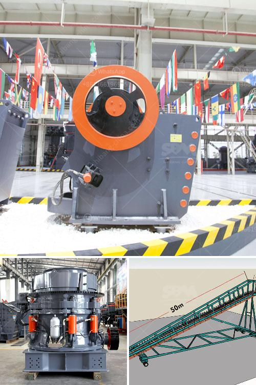

<h3>delhi ball mill ceramic lining</h3>
Ball mills are used in various industries, including mining, construction, and pharmaceuticals, to grind materials into fine powders. These machines require strong and durable linings to withstand the constant wear and tear caused by the grinding process. One popular choice for ball mill linings in Delhi is ceramic lining, known for its exceptional properties.

Ceramic linings offer numerous advantages over traditional metallic linings. Firstly, ceramic materials are highly resistant to abrasion, providing a longer lifespan for the ball mill. This increased durability is essential, particularly in industries where the equipment is subjected to intense grinding for long periods.

Secondly, ceramic linings offer excellent chemical resistance, making them suitable for applications involving corrosive materials. This resistance ensures prolonged performance, preventing damage to the ball mill and eliminating the need for frequent replacements.

Another significant benefit of ceramic linings is their ability to reduce contamination. The smooth, non-porous surface of ceramics prevents the buildup of impurities inside the ball mill, ensuring the production of uncontaminated powders. This is especially crucial in industries such as pharmaceutical manufacturing, where product purity is of utmost importance.

Delhi, being a hub for various industries, requires reliable and efficient ball mill linings that can withstand the challenging working environment. The ball mill ceramic lining in Delhi ensures enhanced efficiency by minimizing downtime due to frequent repairs or replacements. This increased uptime translates into higher productivity and reduced operational costs.

Moreover, the use of ceramic linings also contributes to a more sustainable approach. Their longer lifespan and resistance to wear result in lower material consumption, reducing waste generation. Additionally, the reduced need for frequent replacements conserves valuable resources, making ceramic linings an environmentally friendly choice.

In conclusion, Delhi's ball mills can greatly benefit from ceramic linings due to their exceptional properties. The longer lifespan, resistance to wear and corrosion, and reduced contamination make ceramic linings a top choice for industries reliant on grinding operations. Additionally, these linings promote a sustainable approach, reducing waste generation and conserving resources. By investing in ceramic linings, Delhi's industries can enhance the efficiency and durability of their ball mills, ultimately leading to improved performance and profitability.
<h3>Contact us</h3><ul><li><strong>Whatsapp:&nbsp;<a href="https://wa.me/8613661969651">+8613661969651</a></strong></li><li><a href="https://swt.shibang-china.com/?git&amp;zhl&amp;delhi ball mill ceramic lining"><strong>Online Service(chat now)</strong></a></li></ul><h3>Related</h3><ul><li><a href='business plan for aggregates production plant pdf.md'>business plan for aggregates production plant pdf</a></li><li><a href='horizontal grinding mills price.md'>horizontal grinding mills price</a></li><li><a href='business plan for gold mining company in zimbabwe.md'>business plan for gold mining company in zimbabwe</a></li><li><a href='best machine brands for quarry.md'>best machine brands for quarry</a></li><li><a href='activated carbon a full set of production equipment.md'>activated carbon a full set of production equipment</a></li></ul>