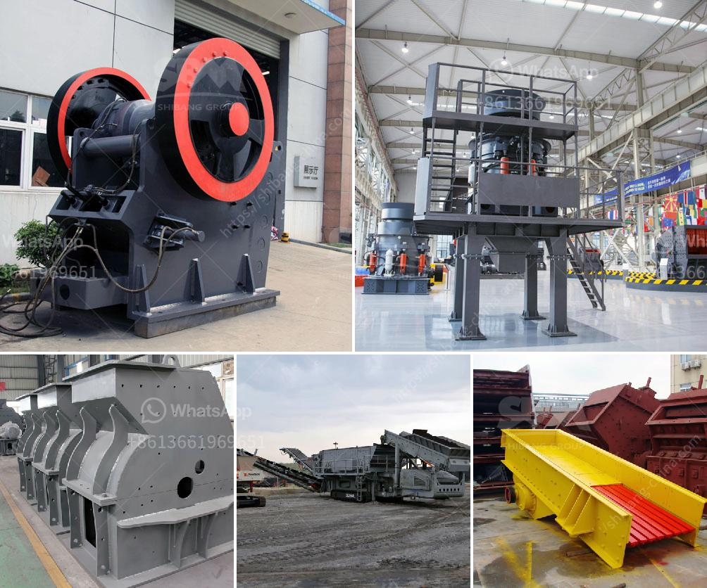

<h3>dental stone jaw crusher</h3>
Dental stone jaw crusher is an important part of every dental laboratory. As the name suggests, it is used for crushing stones to create a finer, more even material. These machines are typically used to reduce the size of large rocks and stones into smaller, more manageable pieces. They are often used in construction, mining, or excavation projects.

Dental stone jaw crushers are designed to be heavy-duty machines. They are built to withstand the constant wear and tear of continuous use in the dental laboratory. These machines are typically made with high-quality materials and designed for longevity.

One of the key features of dental stone jaw crushers is their ability to crush hard, tough materials. This is especially important in dental laboratories because dental stones are often dense and difficult to break. Dental stone jaw crushers provide a reliable and efficient solution for breaking down these materials into smaller, more manageable pieces.

Another benefit of using dental stone jaw crushers is their versatility. These machines can be used to crush a wide range of materials, from hard rocks to soft stones. This makes them suitable for a variety of applications in the dental laboratory. Dental stone jaw crushers can also be used to reduce the size of other dental materials such as dental alloys, porcelain, and gypsum.

In conclusion, dental stone jaw crushers play a crucial role in dental laboratories. They are designed to crush hard, tough materials into smaller, more manageable pieces. These machines are built to be durable and versatile, making them a valuable asset in any dental laboratory. Whether it's breaking down dental stones or reducing the size of other dental materials, dental stone jaw crushers are essential for efficient and effective dental laboratory operations.
<h3>Contact us</h3><ul><li><strong>Whatsapp:&nbsp;<a href="https://wa.me/8613661969651">+8613661969651</a></strong></li><li><a href="https://swt.shibang-china.com/?git&amp;zhl&amp;dental stone jaw crusher"><strong>Online Service(chat now)</strong></a></li></ul><h3>Related</h3><ul><li><a href='cost of 500 tpd cement plant india.md'>cost of 500 tpd cement plant india</a></li><li><a href='gold wash plant for sale canada.md'>gold wash plant for sale canada</a></li><li><a href='ball mill for gold in south africa.md'>ball mill for gold in south africa</a></li><li><a href='almeida stone crusher.md'>almeida stone crusher</a></li><li><a href='tonne stone crusher cost sale.md'>tonne stone crusher cost sale</a></li></ul>