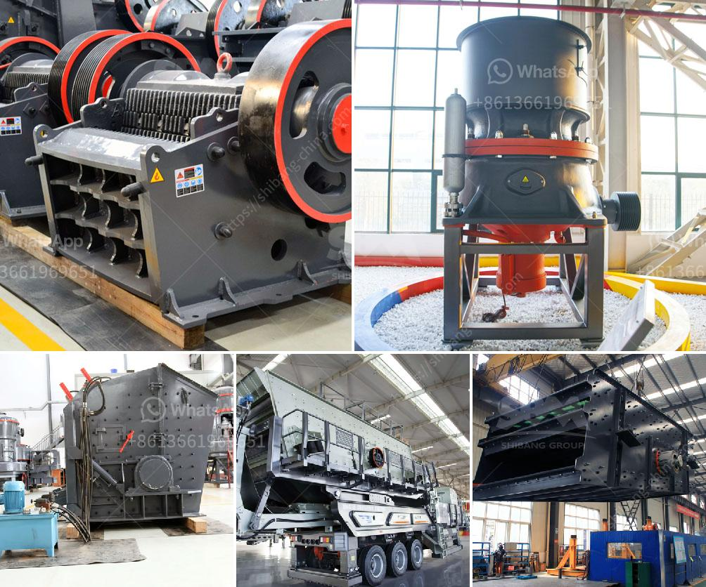

<h3>design calculations of rotary dryer</h3>
The objective of a rotary dryer is to reduce the moisture content in a material, allowing it to be more easily transported or utilized. As the name suggests, rotary dryers are designed for this drying process by rotating the material within a drum to expose it to heat, air, or a combination of both.

To ensure the efficient operation of a rotary dryer, it is essential to perform design calculations to determine the necessary parameters for the drying process. These calculations involve various factors, including the type of material, desired moisture content, feed rate, heat source, and airflow.

One crucial design calculation for a rotary dryer is the sizing of its drum. The drum diameter should be chosen based on the desired capacity of the dryer and the specific moisture content of the material being dried. A larger drum diameter allows for a higher throughput and can help reduce the required drying time.

Another important design calculation is determining the heat transfer coefficient, which is a measure of how effectively heat is transferred from the heat source to the material. This coefficient depends on several factors, including the material properties, drum design, and the type of heat source. The heat transfer coefficient is crucial for selecting an appropriate heat source and designing the necessary heating system.

The airflow rate within the rotary dryer is also a critical design parameter. Sufficient airflow is required to transport the evaporated moisture out of the drum and maintain an optimal drying environment. The airflow rate is influenced by the material properties, drum design, and the desired moisture content. Insufficient airflow can result in uneven drying and increased drying time, while excessive airflow can cause unnecessary energy consumption.

Determining the residence time of the material within the rotary dryer is another essential calculation. The residence time is the duration that the material stays inside the dryer and is influenced by the drum size, rotation speed, feed rate, and desired moisture content. It is important to ensure that the residence time is sufficient for the material to reach the desired moisture level without exceeding it.

The design calculations of a rotary dryer also involve selecting the appropriate heat source. Common heat sources include direct combustion of fuels, such as natural gas or coal, or indirect heat transfer through hot air or other gases. The choice of heat source depends on factors such as cost, availability, and environmental considerations.

Lastly, the power requirements of the rotary dryer need to be calculated to ensure proper equipment sizing. The power consumption is influenced by various factors, including the material properties, drum size, rotation speed, and heat source. Oversized or undersized power supply can result in inefficient drying and unnecessary energy consumption.

In conclusion, design calculations are crucial for the efficient operation and performance of a rotary dryer. These calculations involve determining the drum size, heat transfer coefficient, airflow rate, residence time, heat source, and power requirements. By accurately calculating these parameters, the rotary dryer can be designed to meet the specific drying requirements, resulting in reduced energy consumption, improved drying efficiency, and optimized moisture content in the final product.
<h3>Contact us</h3><ul><li><strong>Whatsapp:&nbsp;<a href="https://wa.me/8613661969651">+8613661969651</a></strong></li><li><a href="https://swt.shibang-china.com/?git&amp;zhl&amp;design calculations of rotary dryer"><strong>Online Service(chat now)</strong></a></li></ul><h3>Related</h3><ul><li><a href='single cylinder hydraulic cone crusher.md'>single cylinder hydraulic cone crusher</a></li><li><a href='vertical roller mill suppliers.md'>vertical roller mill suppliers</a></li><li><a href='hp ball mill motors.md'>hp ball mill motors</a></li><li><a href='safety sings for crusher plant and quarry.md'>safety sings for crusher plant and quarry</a></li><li><a href='stone crushing process.md'>stone crushing process</a></li></ul>