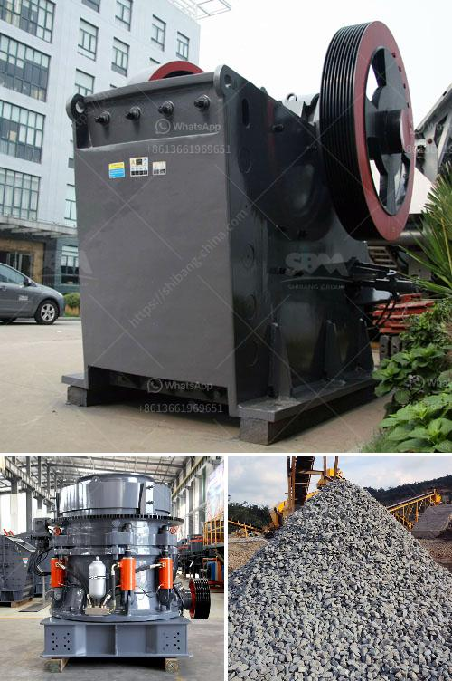

<h3>diamond jaw crusher usa</h3>
Crushing is the first stage of comminution, the process of reducing a material's size and altering its structure. Jaw crushers are a common choice for primary crushing, providing a robust, reliable performance for a variety of materials. However, diamond jaw crusher USA has specially designed for this purpose.

Diamond jaw crusher USA features a unique design that provides superior performance and reliability. The jaws are set at an acute angle that increases the effective crushing zone. This results in an increased capacity and reduces the wear on the crusher. In addition, the diamond jaw crusher USA is designed with a thrusting and tilting mechanism that allows the jaws to open and close with ease. This system ensures a constant and uniform feed rate, preventing material bridging and blockages.

The diamond jaw crusher USA is available in various models including the HJ series, PE series, and JC series. The HJ series jaw crusher has a compact structure and excellent performance, and is more cost-effective compared to other jaw crushers. The PE series jaw crusher is the most common for primary crushing, with a high crushing ratio and production capacity. The JC series jaw crusher is a new type of jaw crusher with optimized design and superior performance, which can be used for secondary and tertiary crushing.

One of the key advantages of the diamond jaw crusher USA is its versatility. It can handle a wide range of materials, including limestone, granite, basalt, iron ore, river pebble, and other hard and abrasive stones. The diamond jaw crusher USA is also suitable for recycling concrete and asphalt materials, making it an ideal choice for construction and demolition waste recycling.

Diamond jaw crusher USA is manufactured with high-quality materials and advanced manufacturing technology. The materials used in the crusher are durable and wear-resistant, ensuring a long service life and low maintenance. The advanced manufacturing technology guarantees a precise and reliable performance, with minimal downtime and easy maintenance.

With the increasing demand for aggregates in construction and mining industries, the diamond jaw crusher USA has become an essential equipment in the crushing process. Its compact size, high crushing capacity, and versatile performance make it a valuable asset for any operation. Moreover, the diamond jaw crusher USA is backed by a dedicated after-sales service and technical support team, ensuring a seamless and hassle-free experience for customers.

In conclusion, the diamond jaw crusher USA is a reliable crushing machine for stone and ore. Its robust design, high performance, and versatility make it an essential equipment in any crushing operation. Whether it is for primary or secondary crushing, the diamond jaw crusher USA delivers superior performance and reliable results.
<h3>Contact us</h3><ul><li><strong>Whatsapp:&nbsp;<a href="https://wa.me/8613661969651">+8613661969651</a></strong></li><li><a href="https://swt.shibang-china.com/?git&amp;zhl&amp;diamond jaw crusher usa"><strong>Online Service(chat now)</strong></a></li></ul><h3>Related</h3><ul><li><a href='types of equipments used in cement industry.md'>types of equipments used in cement industry</a></li><li><a href='used sand mobile washing equipment.md'>used sand mobile washing equipment</a></li><li><a href='graphite powder machine.md'>graphite powder machine</a></li><li><a href='price for cone crusher.md'>price for cone crusher</a></li><li><a href='milling machine of jaw crusher.md'>milling machine of jaw crusher</a></li></ul>