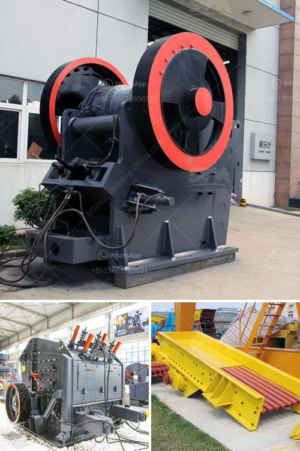

<h3>diamond mining equipment companies in usa</h3>
Diamonds, the symbol of everlasting love and the pinnacle of luxury, require extensive mining and processing to become the dazzling gems we see in jewelry stores. In the United States, where the diamond mining industry is flourishing, several equipment companies contribute to its success. These companies play a crucial role in providing the necessary tools and machinery for diamond mining operations, ensuring efficiency and sustainability in the process.

One renowned company in the diamond mining equipment industry is Jewel Master. Established in the heart of the United States, Jewel Master has been a leading provider of comprehensive and innovative diamond mining equipment for decades. Their products range from advanced drilling machinery to cutting-edge sorting and processing equipment. Jewel Master takes pride in their commitment to research and development, constantly striving to improve their equipment's functionality and performance.

Another key player in the industry is Diamond Mining Corporation (DMC). With a focus on innovation and sustainability, DMC has introduced groundbreaking technologies in the diamond mining sector. Their state-of-the-art equipment not only enhances productivity but also minimizes environmental impact. DMC's dedication to sustainable practices aligns with the increasing demand for ethically sourced diamonds, ensuring that their equipment meets the stringent standards of the industry.

Diamond Mining Equipment USA (DME USA) is another prominent equipment company that specializes in providing cutting-edge technologies for the diamond mining sector. Their equipment includes high-powered drilling machines, efficient sorting systems, and advanced diamond recovery tools. DME USA is known for its customer-centric approach, offering tailored solutions to meet the unique requirements of each mining operation. The company is committed to helping its clients achieve maximum productivity while maintaining the highest standards of safety and sustainability.

When it comes to diamond mining equipment in the United States, GemTech is a name that cannot be overlooked. GemTech's products are known for their superior quality, reliability, and durability. From heavy-duty machinery to precision cutting and polishing instruments, their equipment covers the entire diamond mining process. GemTech's dedication to continuous improvement and staying abreast of the latest technological advancements enables them to remain at the forefront of the industry.

The diamond mining industry, though glamorous, requires a robust infrastructure supported by efficient equipment companies. These companies provide the necessary tools and machinery to extract, sort, and process diamonds effectively and sustainably. Jewel Master, Diamond Mining Corporation, Diamond Mining Equipment USA, and GemTech are some of the leading equipment companies in the United States that contribute significantly to the success of diamond mining operations.

As the demand for diamonds continues to grow globally, these companies play a vital role in ensuring a reliable supply of these precious gems. By investing in research and development, embracing sustainability, and prioritizing customer satisfaction, these equipment companies are instrumental in driving the success of the diamond mining industry in the United States and beyond.
<h3>Contact us</h3><ul><li><strong>Whatsapp:&nbsp;<a href="https://wa.me/8613661969651">+8613661969651</a></strong></li><li><a href="https://swt.shibang-china.com/?git&amp;zhl&amp;diamond mining equipment companies in usa"><strong>Online Service(chat now)</strong></a></li></ul><h3>Related</h3><ul><li><a href='ball mill plant manufacturers.md'>ball mill plant manufacturers</a></li><li><a href='portable hammer mill for gold ore.md'>portable hammer mill for gold ore</a></li><li><a href='marble and granite plant.md'>marble and granite plant</a></li><li><a href='jaw stone crusher zimbabwe.md'>jaw stone crusher zimbabwe</a></li><li><a href='industrial impact crusher.md'>industrial impact crusher</a></li></ul>