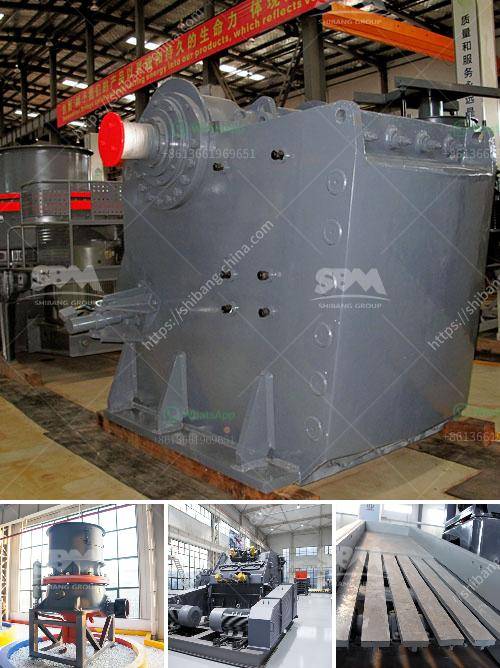

<h3>diamond mobile wash plant price</h3>
Diamond mining is a highly lucrative industry that has been attracting investors from all over the world. With the increasing demand for diamonds in various industries such as jewelry, technology, and manufacturing, there has been a need for efficient and cost-effective methods of diamond extraction. One such method is the use of mobile wash plants, which have proven to be highly efficient and productive in diamond mining.

A mobile wash plant is a portable machine that uses water to wash and separate valuable diamond-bearing material from worthless rocks and sediments. This innovative technology has made diamond mining more accessible and profitable, especially in remote locations where it is difficult to transport heavy machinery.

One of the key factors that potential diamond miners consider when investing in a mobile wash plant is the price. The price of a mobile wash plant can vary greatly depending on a variety of factors, including the capacity, features, and manufacturer. Generally, the price range for a mobile wash plant for diamond mining is between $200,000 and $600,000.

The capacity of a mobile wash plant refers to the amount of material it can process within a given time frame. This is an important factor to consider as it determines the productivity and profitability of the diamond mining operation. Typically, a mobile wash plant with a larger capacity will have a higher price. A plant with a capacity of processing 100-150 tons of material per hour can cost around $200,000, while a plant with a capacity of 200-300 tons per hour can cost up to $400,000.

Features are another determinant of the mobile wash plant price. Some mobile wash plants come with advanced features such as automatic feeding systems, variable speed controls, and adjustable sluice boxes, which enhance the efficiency and effectiveness of the diamond recovery process. These features often come at an additional cost, increasing the overall price of the plant.

The manufacturer of the mobile wash plant also plays a significant role in the price. Well-established and reputable manufacturers tend to offer higher quality and more durable plants, which may come at a higher price. However, it is important to note that investing in a reliable and high-quality mobile wash plant can result in long-term cost savings, as it will require fewer repairs and replacements.

Aside from the initial price, it is crucial to consider the operational costs associated with a mobile wash plant. These costs include fuel and water consumption, maintenance, labor, and site preparation. These expenses can vary depending on the location and conditions of the diamond mining operation. Therefore, it is recommended to carefully assess these costs and calculate the potential return on investment before purchasing a mobile wash plant.

In conclusion, a mobile wash plant is an essential tool in the diamond mining industry, facilitating efficient extraction and separation of valuable diamonds. The price of a mobile wash plant can vary depending on factors such as capacity, features, and manufacturer. Potential investors should carefully consider these factors, as well as the operational costs, to make an informed decision. Investing in a reliable and high-quality mobile wash plant can lead to significant profits and long-term success in the diamond mining business.
<h3>Contact us</h3><ul><li><strong>Whatsapp:&nbsp;<a href="https://wa.me/8613661969651">+8613661969651</a></strong></li><li><a href="https://swt.shibang-china.com/?git&amp;zhl&amp;diamond mobile wash plant price"><strong>Online Service(chat now)</strong></a></li></ul><h3>Related</h3><ul><li><a href='ethiopia stone crushing industry.md'>ethiopia stone crushing industry</a></li><li><a href='technical data sheet of stone crusher.md'>technical data sheet of stone crusher</a></li><li><a href='gypsum crusher machine for sale.md'>gypsum crusher machine for sale</a></li><li><a href='mtm grinding mill.md'>mtm grinding mill</a></li><li><a href='chrome mining business plan crusher.md'>chrome mining business plan crusher</a></li></ul>