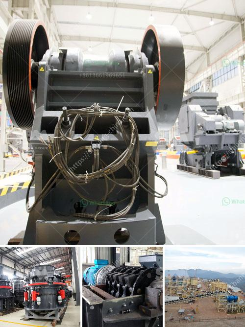

<h3>diesel engine hammer mill crusher</h3>
The diesel engine hammer mill crusher is an important equipment in the mining machinery industry. It is a kind of crusher that can crush materials with the maximum particle size of 600-1800 mm to 25 or below 25 mm. Hammer mill crusher is widely used in many industries such as mining, smelting, building materials, roads, railways, water conservancy and chemical industries.

The working principle of diesel engine hammer mill crusher is that when the materials are put into the chamber of the hammer crusher, they are crushed by the high-speed rotating hammers. Then the crushed materials are thrown towards the crushing plate where they are crushed again. This process repeats until the materials are discharged through the grate plate at the bottom of the crusher.

One of the advantages of diesel engine hammer mill crusher is that it can crush materials with moisture content lower than 20%. Therefore, it is suitable for crushing materials with high moisture content and clayey materials. In addition, the diesel engine hammer mill crusher can be used not only in dry condition, but also in wet condition.

The diesel engine hammer mill crusher has the following characteristics. First, the diesel engine hammer mill crusher has simple structure and compact size. It is easy to operate and maintain. Second, the diesel engine hammer mill crusher has high reduction ratio and high crushing efficiency. It can crush materials with high hardness and strong toughness. Third, the diesel engine hammer mill crusher has low energy consumption. It can save energy by 40% compared with the traditional hammer crusher. Fourth, the diesel engine hammer mill crusher has low noise and less dust pollution.

The diesel engine hammer mill crusher is suitable for crushing all kinds of medium hardness and brittle materials, such as limestone, coal, salt, white sub, gypsum, brick, limestone and so on. The compressive strength of the materials to be crushed should not exceed 150 MPa. It is widely used in cement, coal, power, metallurgy, chemical industry and other industries.

In conclusion, the diesel engine hammer mill crusher is an important equipment in the mining machinery industry. It has the advantages of simple structure, high reduction ratio, low energy consumption, low noise, and less dust pollution. It is suitable for crushing all kinds of medium hardness and brittle materials. With the continuous improvement of mining technology, the diesel engine hammer mill crusher will be more widely used in various industries.
<h3>Contact us</h3><ul><li><strong>Whatsapp:&nbsp;<a href="https://wa.me/8613661969651">+8613661969651</a></strong></li><li><a href="https://swt.shibang-china.com/?git&amp;zhl&amp;diesel engine hammer mill crusher"><strong>Online Service(chat now)</strong></a></li></ul><h3>Related</h3><ul><li><a href='crushing plant and equipment.md'>crushing plant and equipment</a></li><li><a href='coal washing plant for sale in south africa.md'>coal washing plant for sale in south africa</a></li><li><a href='cost setting up limestone mine.md'>cost setting up limestone mine</a></li><li><a href='lavadoras de arenas y agregados.md'>lavadoras de arenas y agregados</a></li><li><a href='ethiopia gypsum manufacturers.md'>ethiopia gypsum manufacturers</a></li></ul>