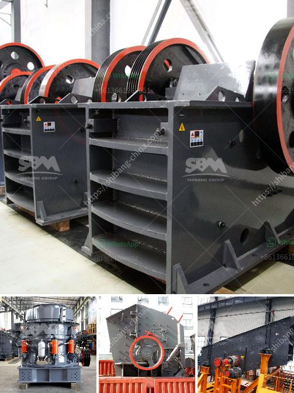

<h3>difference between residual and transported soil</h3>
Residual and transported soil are two distinct types with various characteristics and formation processes. Understanding their differences is crucial in the field of earth sciences and can help in differentiating between soil types found in specific regions.

Residual soil, also known as residual regolith, is formed in situ, meaning it develops from the underlying bedrock that weathers and decomposes over time. This type of soil tends to remain in the location where it was formed. The weathering processes, such as physical, chemical, and biological weathering, contribute to the formation of residual soil. Over millions of years, weathering agents like water, wind, temperature fluctuations, and plant roots collectively break down the rock into smaller particles. The accumulated decomposed material forms a distinct layer of residual soil on top of the bedrock. Residual soil is usually found in areas with slow erosion rates and little to no transportation.

On the other hand, transported soil, as the name suggests, is soil that has been moved from one place to another by various geological and environmental factors. This type of soil is typically carried and deposited by erosion agents, such as water, wind, ice, or gravity. Transported soil can be found in different locations from their original source. For instance, soil can be transported by rivers and deposited along their banks or in flood plains. Glaciers can transport soil over long distances and leave behind a mixture of particles in their melting process. Wind erosion can pick up fine particles of soil and carry them to new areas where they settle, forming transported soil.

The main difference between residual and transported soil lies in their location and how they were formed. Residual soil remains in the place of its origin, forming a layer above the bedrock through weathering processes. Transported soil, on the other hand, is carried and deposited by external agents, causing it to be found at varying distances from its original source.

Residual soil tends to maintain certain characteristics similar to its parent rock, such as mineral composition, texture, and color. It also retains some of the bedrock's geological features. In contrast, transported soil can have a mixture of particles from different sources, leading to a more diverse composition.

The understanding of residual and transported soil is vital in diverse fields ranging from agriculture to engineering. Farmers need to recognize the soil type on their land to optimize their agricultural practices and understand the soil's fertility and water-holding capacity. Engineers must consider the soil characteristics when designing infrastructure projects such as buildings, roads, and foundations. Additionally, geologists study these soil types to better understand the geological history and processes that contribute to landscape formation.

In conclusion, residual and transported soils differ fundamentally in their formation processes and location. Residual soil develops in situ through weathering of the underlying bedrock, remaining in the place of origin. Transported soil, on the other hand, is carried and deposited by external agents, leading to its appearance in various locations. Understanding these differences is crucial for various fields and enables a better understanding of soil properties, agricultural practices, and geological processes.
<h3>Contact us</h3><ul><li><strong>Whatsapp:&nbsp;<a href="https://wa.me/8613661969651">+8613661969651</a></strong></li><li><a href="https://swt.shibang-china.com/?git&amp;zhl&amp;difference between residual and transported soil"><strong>Online Service(chat now)</strong></a></li></ul><h3>Related</h3><ul><li><a href='mobile chrushers south africa.md'>mobile chrushers south africa</a></li><li><a href='aggregates crashing plant in nigeria.md'>aggregates crashing plant in nigeria</a></li><li><a href='egypt gypsum powder manufacturer.md'>egypt gypsum powder manufacturer</a></li><li><a href='granite quarry crusher equipment.md'>granite quarry crusher equipment</a></li><li><a href='crushing plant and equipment.md'>crushing plant and equipment</a></li></ul>