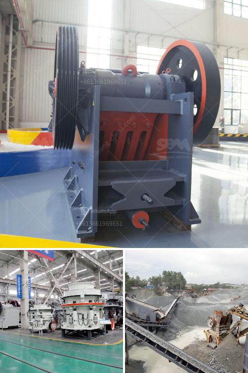

<h3>differences with gyratory crusher cone crusher</h3>
Crushers play an important role in the material handling process for various industries. Whether it's mining, construction, or demolition, they can be utilized to contribute to optimal particle size reduction for a wide range of materials. Two popular crushing equipment options available are the gyratory crusher and the cone crusher. While they both provide excellent results and are used by professionals in various industries, there are notable differences between the two crushers. This article aims to shed light on these differences to help professionals make informed decisions regarding their crushing needs.

The gyratory crusher is a large crusher that utilizes a crushing head mounted on an eccentric shaft to crush the stones against the bowl. It is used for high-capacity primary crushing of rocks and minerals, producing a consistent product size with a high reduction ratio. The gyratory crusher is similar in basic concept to a jaw crusher, but its crushing chamber is wider, allowing it to handle larger feed sizes. This results in a higher throughput capacity when compared to a similar sized cone crusher.

On the other hand, the cone crusher is used for medium-to-fine crushing of hard-to-medium-hard rocks and ores. Although it has a smaller feed opening and a shorter crushing chamber, it still delivers excellent output performance and offers a reduction ratio of up to 6:1. The cone crusher provides a relatively low cost per tonne of production as compared to the gyratory crusher.

One significant difference between these two crushers is the shape of the crushing head. The gyratory crusher has a conical head with a concave surface and a larger mantle at the bottom. This shape enables the crushing process to be continuous and uninterrupted, while ensuring a consistent product size. In contrast, the cone crusher has a steep crushing cone, allowing for a larger reduction ratio with a coarser feed material. This shape also provides a more evenly distributed particle size curve in the crushed material.

Another distinction between these two crushers can be found in their application areas. The gyratory crusher is primarily used for large-scale mining, whereas the cone crusher is commonly used in smaller plants, both for mining and construction purposes. Moreover, the cone crusher is usually used as a secondary or tertiary crushing solution, while the gyratory crusher is mainly used for primary crushing.

Maintenance and operation requirements are also distinct for these crushers. The gyratory crusher requires regular inspections and preventive maintenance to ensure its reliable operation. Additionally, it often requires a skilled workforce to operate and maintain its complex mechanism. In contrast, the cone crusher is relatively simple to operate and maintain. Common maintenance tasks include replacing wear parts, checking fluid levels, and lubing the bearings.

In conclusion, both the gyratory crusher and the cone crusher offer excellent performance in their respective areas of application. The choice between the two ultimately depends on the specific requirements and preferences of the industry. While the gyratory crusher offers higher capacity and continuous operation, the cone crusher provides a more versatile crushing solution with lower maintenance requirements. Understanding these differences will help professionals make the right crusher selection based on their application needs.
<h3>Contact us</h3><ul><li><strong>Whatsapp:&nbsp;<a href="https://wa.me/8613661969651">+8613661969651</a></strong></li><li><a href="https://swt.shibang-china.com/?git&amp;zhl&amp;differences with gyratory crusher cone crusher"><strong>Online Service(chat now)</strong></a></li></ul><h3>Related</h3><ul><li><a href='used rock crushers for sale in germany.md'>used rock crushers for sale in germany</a></li><li><a href='buy nigeria stone crusher.md'>buy nigeria stone crusher</a></li><li><a href='changsha kaiyuan coal crusher.md'>changsha kaiyuan coal crusher</a></li><li><a href='mica powder machine.md'>mica powder machine</a></li><li><a href='crushers screeners conveyor manufacturers in india.md'>crushers screeners conveyor manufacturers in india</a></li></ul>