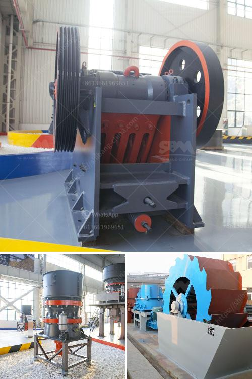

<h3>distribuidores de equipo de trituracion extec</h3>
Distribuidores de Equipo de Trituración Extec: La Mejor Opción para tus Necesidades de Trituración

El proceso de trituración es esencial en la industria de la construcción y la minería. Para llevar a cabo este proceso de manera eficiente y efectiva, es esencial contar con equipo de trituración de calidad. Una de las marcas líderes en el mercado de equipo de trituración es Extec. Su compromiso con la innovación y la calidad ha hecho que sean una opción popular para muchos distribuidores y usuarios finales.

Los distribuidores de equipo de trituración Extec son una excelente opción para aquellos que buscan adquirir equipo de trituración de alta calidad. Extec cuenta con una amplia gama de equipos, que van desde trituradoras de mandíbulas hasta trituradoras de impacto y cribas móviles. Esto significa que pueden satisfacer una amplia variedad de necesidades de trituración y cribado.

Una de las ventajas de elegir distribuidores de equipo de trituración Extec es su compromiso con la calidad. Extec se ha ganado una reputación como un fabricante confiable y de calidad en la industria debido a su enfoque en la ingeniería de precisión y la innovación técnica. Esto se traduce en equipos de trituración que están diseñados para durar y ofrecer un rendimiento constante.

Además de la calidad del equipo de trituración Extec, los distribuidores también ofrecen una amplia gama de servicios de soporte postventa. Estos servicios pueden incluir asistencia técnica, mantenimiento programado, piezas de repuesto y capacitación para el personal. Esto significa que los usuarios finales pueden contar con el respaldo de expertos en caso de necesitar asistencia técnica o mantenimiento.

Otra ventaja de elegir distribuidores de equipo de trituración Extec es su amplia red de distribución. Extec cuenta con distribuidores en todo el mundo, lo que significa que puedes encontrar su equipo de trituración en prácticamente cualquier parte. Esta red de distribución global es especialmente beneficiosa para aquellos usuarios que trabajan en proyectos internacionales, ya que pueden contar con el respaldo de distribuidores locales.

A la hora de elegir distribuidores de equipo de trituración Extec, es importante tener en cuenta la reputación y experiencia del distribuidor. Busca distribuidores con una trayectoria probada en la venta y soporte de equipos de trituración. También es recomendable leer reseñas y testimonios de otros usuarios para tener una idea de la calidad del servicio que ofrecen.

En resumen, los distribuidores de equipo de trituración Extec son una excelente opción para aquellos que buscan adquirir equipo de trituración de alta calidad. Su compromiso con la calidad, la innovación y el servicio al cliente los convierte en una opción confiable y confiable. Al elegir distribuidores de equipo de trituración Extec, puedes tener la tranquilidad de saber que estás invirtiendo en una solución de trituración que cumplirá con tus necesidades a largo plazo. No dudes en contactar a un distribuidor autorizado de Extec para obtener más información sobre sus productos y servicios.
<h3>Contact us</h3><ul><li><strong>Whatsapp:&nbsp;<a href="https://wa.me/8613661969651">+8613661969651</a></strong></li><li><a href="https://swt.shibang-china.com/?git&amp;zhl&amp;distribuidores de equipo de trituracion extec"><strong>Online Service(chat now)</strong></a></li></ul><h3>Related</h3><ul><li><a href='usa vertical roller mill.md'>usa vertical roller mill</a></li><li><a href='second hand ball mill manufacturer in india.md'>second hand ball mill manufacturer in india</a></li><li><a href='used crushers in germany for sale.md'>used crushers in germany for sale</a></li><li><a href='mica powder machine.md'>mica powder machine</a></li><li><a href='stone crusher plant price in india.md'>stone crusher plant price in india</a></li></ul>