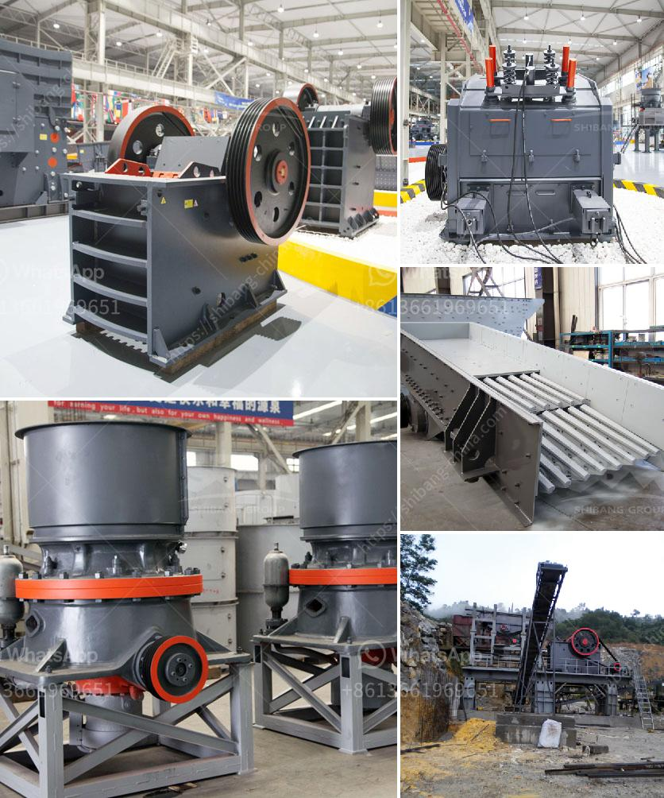

<h3>dolomite ball mill price</h3>
Dolomite is a kind of carbonate mineral which includes iron dolomite and manganese dolomite. It is mainly used as a flux in the iron and steel industry, as a raw material in the glass and ceramic industry, and as an ornamental stone in the construction industry.

As a high-efficiency and energy-saving equipment, dolomite ball mill is widely used in the grinding industry. With the increase in the number of ball mills on the market, dolomite ball mill has become more and more affordable for users. It not only has a competitive price, but also has guaranteed quality, bringing more benefits to users.

The price of a dolomite ball mill is determined by many factors, such as the specifications, model, production capacity, etc. In general, the bigger the model, the higher the price, but it can also meet the needs of higher production capacity. Different manufacturers have different prices for dolomite ball mills due to different production costs and economic strength. Therefore, it is recommended to choose a reliable manufacturer with a good reputation and product quality assurance.

In addition to the price factor, it is also important to pay attention to the after-sales service when purchasing a dolomite ball mill. Manufacturers with excellent after-sales service can provide timely maintenance and repair services, as well as technical support, which can effectively reduce the downtime of the equipment and ensure the normal operation of the production line. Therefore, it is necessary to choose a manufacturer with excellent after-sales service.

The dolomite ball mill can be divided into continuous type and batch type ball mill according to different discharging methods. Continuous-type ball mills can grind materials continuously and are mainly used for fine grinding and mixing of materials. Batch-type ball mills are mainly used for grinding and mixing of materials in the production process. The grinding media in the dolomite ball mill can be steel balls, steel forgings or ceramic balls, etc., depending on the specific requirements of the grinding process.

In summary, when purchasing a dolomite ball mill, it is necessary to consider the price, product quality, and after-sales service comprehensively. Choosing a reliable manufacturer with a reasonable price, guaranteed quality, and excellent after-sales service can effectively save investment costs, improve production efficiency, and bring more economic benefits. It is recommended to conduct a comprehensive comparison and selection before making a decision to ensure the best choice for your production line.
<h3>Contact us</h3><ul><li><strong>Whatsapp:&nbsp;<a href="https://wa.me/8613661969651">+8613661969651</a></strong></li><li><a href="https://swt.shibang-china.com/?git&amp;zhl&amp;dolomite ball mill price"><strong>Online Service(chat now)</strong></a></li></ul><h3>Related</h3><ul><li><a href='mining equipment made in germany.md'>mining equipment made in germany</a></li><li><a href='mining equipment manufacturers colombia.md'>mining equipment manufacturers colombia</a></li><li><a href='cara menghitung nar batubara in jakarta.md'>cara menghitung nar batubara in jakarta</a></li><li><a href='crushing  screening equipment.md'>crushing & screening equipment</a></li><li><a href='used cement grinding mill for sale in uae.md'>used cement grinding mill for sale in uae</a></li></ul>