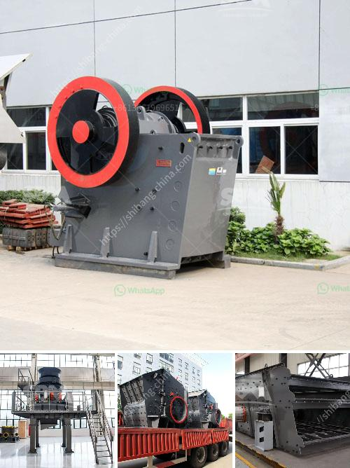

<h3>dolomite crusher equipment</h3>
Dolomite is a calcium magnesium carbonate mineral that has many characteristics similar to calcite. In places where accessible materials are not available, dolomite is used as a substitute for limestone. It is a key ingredient in the production of glass, ceramics, and fertilizer. Dolomite is also commonly used in the construction industry for road base and as an aggregate in concrete and asphalt mixtures.

To extract dolomite, the first step is to quarry the dolomite deposit. Using explosives and heavy machinery, the dolomite rock is extracted, crushed, and processed to separate dolomite ore from impurities. The purified dolomite ore is then transported to a processing plant where it is crushed, screened, and separated into different sizes for a variety of applications.

One of the essential pieces of equipment in the dolomite crushing plant is the dolomite crusher machine. Dolomite crusher machines are designed to meet the requirements of the dolomite stone quarrying and mining industry. Dolomite crusher machines can produce dolomite powder with a particle size of 10-300mm. Various dolomite crushers are available, such as jaw crusher, impact crusher, and cone crusher.

You can choose a suitable dolomite crusher machine according to your specific needs. The cone crusher is usually used for medium and fine crushing operations, while the jaw crusher and impact crusher are commonly used for coarse and medium crushing. The hydraulic cone crusher is a kind of advanced crusher machine with high power, large crushing ratio, and high productivity. It is suitable for fine crushing of various ores and rocks with medium hardness and above.

When selecting a dolomite crusher machine, it is essential to consider the efficiency, maintenance, and energy consumption. Dolomite crushing machines with advanced technology, reliable quality, and excellent performance are more likely to attract customers. The cost of the dolomite crusher machine is an important factor to consider as well. Customers can choose suitable dolomite crushers based on their actual needs and budget.

In conclusion, the dolomite crusher machine designed by our company is the most professional and efficient dolomite crushers on the market. The dolomite crusher production lines we specifically designed and produced for customers offer many advantages, such as large output, high efficiency, high stabilization, and high crushing capacity. If you are interested in dolomite crushing equipment, you can contact us for more details.
<h3>Contact us</h3><ul><li><strong>Whatsapp:&nbsp;<a href="https://wa.me/8613661969651">+8613661969651</a></strong></li><li><a href="https://swt.shibang-china.com/?git&amp;zhl&amp;dolomite crusher equipment"><strong>Online Service(chat now)</strong></a></li></ul><h3>Related</h3><ul><li><a href='mining conveyors for sale in zimbabwe.md'>mining conveyors for sale in zimbabwe</a></li><li><a href='trommel ball mill.md'>trommel ball mill</a></li><li><a href='coal washing plant for sale.md'>coal washing plant for sale</a></li><li><a href='vertical roller mill suppliers.md'>vertical roller mill suppliers</a></li><li><a href='mining equipment manufacturers colombia.md'>mining equipment manufacturers colombia</a></li></ul>