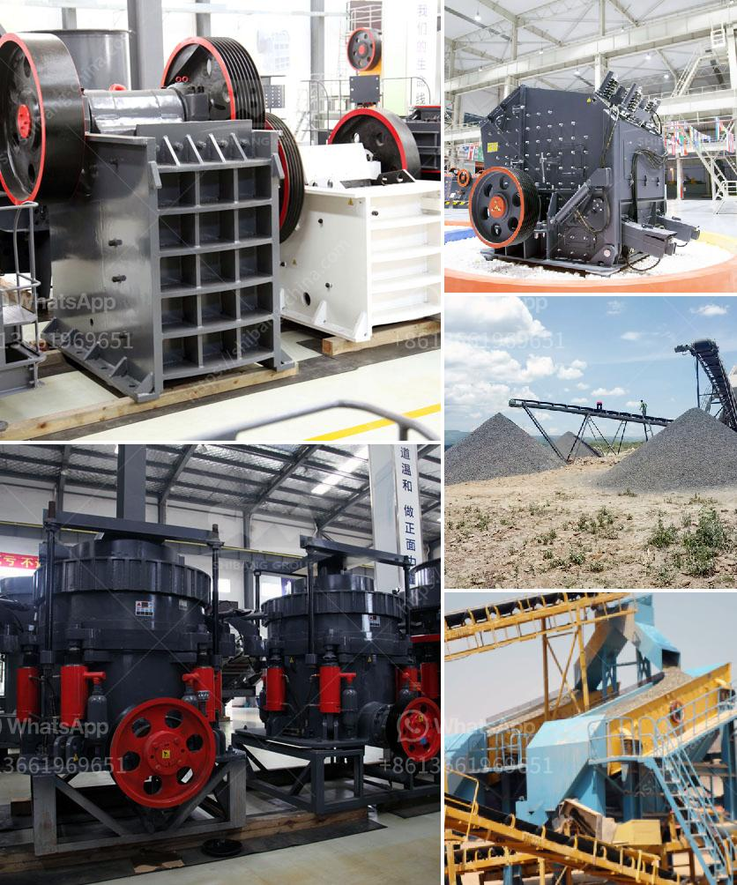

<h3>dolomite crushing machine mill</h3>
Dolomite is a carbonate mineral composed of calcium magnesium carbonate. It is widely used in various industrial sectors such as construction, agriculture, and environmental protection. Due to its versatile applications, dolomite is often crushed and milled to meet the requirements of various industries. In this article, we will discuss the dolomite crushing machine mill and its application in different industries.

The dolomite crushing machine mill is a type of high-efficiency crushing equipment. It is characterized by simple structure, large crushing ratio, low energy consumption, high production capacity, and even product granularity. It is suitable for crushing medium and hard materials, such as limestone, dolomite, sandstone, graphite, and rock salt.

The key equipment for crushing dolomite is the dolomite crusher. After being crushed by the crusher, the dolomite can be further processed by the dolomite milling machine. The dolomite milling machine is an important part of the dolomite crushing and milling process. It not only can improve the utilization rate of dolomite resources, but also can improve the economic benefits of the whole dolomite processing plant.

To optimize the production capacity and profits of the dolomite crushing and milling plant, we need to choose the best dolomite crusher and dolomite grinding machine in the dolomite processing plant. The dolomite crushing machine mill should be designed according to the ore characteristics, equipment configuration and operational requirements of the production line.

Based on these factors, we recommend using jaw crusher and impact crusher to process dolomite. Jaw crusher is used for primary crushing, and impact crusher is used for secondary and fine crushing.

After the dolomite is crushed, it is transported to the dolomite milling machine for grinding. The dolomite milling machine can grind dolomite into powder, thereby greatly improving its application value. Dolomite grinding can be divided into wet grinding and dry grinding. According to the different grinding methods, the dolomite mill can be divided into ball mill, Raymond mill, ultrafine mill, trapezium mill, etc.

The dolomite crushing machine mill produced by our company has a high degree of automation, high grinding efficiency, low operating cost, energy saving and environmental protection, and high utilization rate of resources. It is the best choice for dolomite processing plant.

In conclusion, the dolomite crushing machine mill plays an important role in the dolomite processing plant. With the development of construction industry, the demand for dolomite will continue to increase. In order to meet the demand of various industries for dolomite, we need to choose the best dolomite crusher and dolomite grinding machine. By choosing the right equipment, we can maximize the utilization rate of dolomite resources and create greater economic benefits.
<h3>Contact us</h3><ul><li><strong>Whatsapp:&nbsp;<a href="https://wa.me/8613661969651">+8613661969651</a></strong></li><li><a href="https://swt.shibang-china.com/?git&amp;zhl&amp;dolomite crushing machine mill"><strong>Online Service(chat now)</strong></a></li></ul><h3>Related</h3><ul><li><a href='how much making limestone powder factory costs.md'>how much making limestone powder factory costs</a></li><li><a href='raymond mill in collins.md'>raymond mill in collins</a></li><li><a href='grinding mill machine for sale.md'>grinding mill machine for sale</a></li><li><a href='stone crusher dubai.md'>stone crusher dubai</a></li><li><a href='stone crusher machine price in south africa.md'>stone crusher machine price in south africa</a></li></ul>