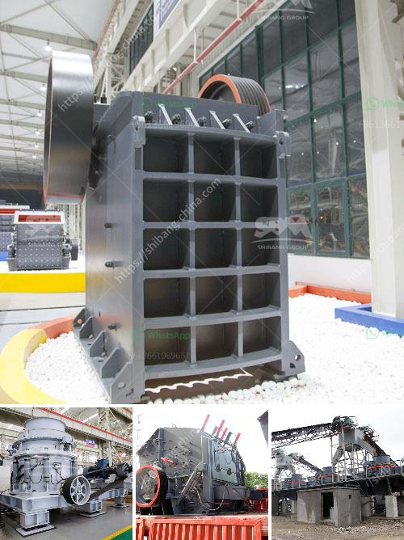

<h3>dolomite powder making machine for processing line</h3>
Dolomite is a natural mineral composed of calcium magnesium carbonate. It is commonly used as a raw material for the production of cement, ceramics, glass, and fertilizers. Dolomite powder is also used in the agriculture and livestock industries to adjust soil pH levels and provide important nutrients. To meet the increasing demand for dolomite, a efficient and effective dolomite powder making machine is necessary.

The dolomite powder making machine plays a key role in the dolomite processing line. It is the main processing tool for ore processing. With the continuous innovation and development of technology, the dolomite powder making machine has become a popular machine in the dolomite processing industry.

The dolomite powder making machine is made of high-quality materials, precision-made parts, and advanced production techniques to ensure reliable performance. The overall structure of the machine is simple, easy to operate, and maintain, saving both time and effort. It is equipped with a strong turbine classifier, which can accurately control the fineness of the finished powder, ensuring uniform particle distribution and high production efficiency.

The dolomite powder making machine adopts advanced grinding rollers and grinding rings, which not only improves the grinding efficiency but also enhances the wear resistance of the machine. The grinding rollers and grinding rings are made of wear-resistant materials, which have a longer service life, reducing the frequency of replacement and maintenance costs.

Furthermore, the dolomite powder making machine is equipped with a dust removal system, which effectively reduces the dust pollution during the production process, making it environmentally friendly. The machine also has a sound insulation and noise reduction system, which helps to create a quiet and comfortable working environment.

In addition to its high performance and reliable quality, the dolomite powder making machine has a wide range of applications. It can process various materials with a Mohs hardness of less than 7 and a humidity below 6%, such as limestone, gypsum, calcium carbonate, barite, calcite, Bentonite, granite, etc. The machine can be used in various industries, including mining, metallurgy, chemical, building materials, and agriculture.

In conclusion, the dolomite powder making machine is an essential equipment in the dolomite processing line. Its high efficiency, reliability, and wide range of applications make it the ideal choice for processing dolomite powder. With the continual advancement of technology, the dolomite powder making machine will continue to evolve, providing better performance and higher output, meeting the increasing demand for dolomite in various industries.
<h3>Contact us</h3><ul><li><strong>Whatsapp:&nbsp;<a href="https://wa.me/8613661969651">+8613661969651</a></strong></li><li><a href="https://swt.shibang-china.com/?git&amp;zhl&amp;dolomite powder making machine for processing line"><strong>Online Service(chat now)</strong></a></li></ul><h3>Related</h3><ul><li><a href='fully mobile limestone crusher.md'>fully mobile limestone crusher</a></li><li><a href='cost estimation for ball mills.md'>cost estimation for ball mills</a></li><li><a href='rock quarry plant.md'>rock quarry plant</a></li><li><a href='sell of crushing machine in lima.md'>sell of crushing machine in lima</a></li><li><a href='quick lime hammer crusher.md'>quick lime hammer crusher</a></li></ul>