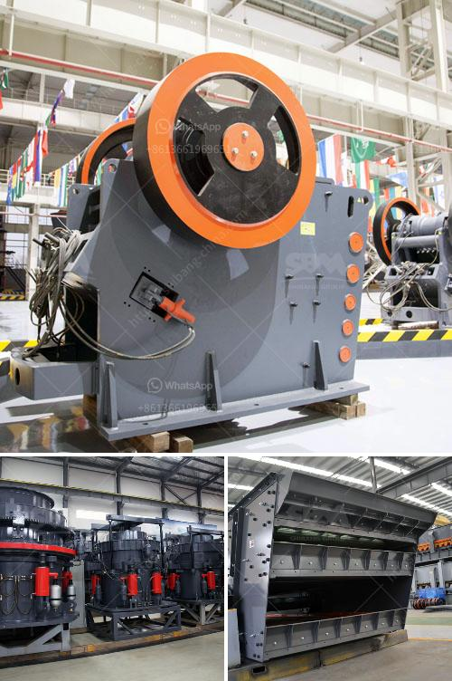

<h3>double roll crusher china</h3>
Double roll crusher China has been known to be a machine used for crushing materials by compressing them between pairs of mutually revolving rollers. It is important to note that the material is crushed only once and then falls down in a natural way. With years of experience in the production of crushing machinery, Shanghai Shunky Machinery Co., Ltd. is a reliable company that has been setting the industry standard for quality and durability.

The double roll crusher China is designed to be used for breaking rocks of medium hardness, such as coal, coke, limestone, and cement clinker in various industries such as ore mining, cement production, chemical industry, and power plants. It can crush materials with a compressive strength of up to 160 Mpa, and the discharging granularity can be adjusted as per the customers’ requirements.

One important aspect of the double roll crusher China is the ability to produce a narrow particle size distribution, thus minimizing the production of undesired fines. This is critical in industries where the fines could damage downstream equipment, or where minimizing product size variation is essential.

Another advantage of the double roll crusher China is that it can provide a substantial increase in throughput capacity. Crushing rates can reach up to 500 tph, depending on the material properties, machine design, and operational parameters. This high crushing capacity is especially beneficial in industries that require high production rates, such as mining and quarrying.

The double roll crusher China also has the capability to produce a uniform product size distribution, thus minimizing the production of undesired fines. This is particularly important in industries where the fines could damage downstream equipment, or where minimizing product size variation is critical.

The double roll crusher China offers a variety of options to meet the specific requirements of each application. It can be equipped with a motor or diesel engine depending on the power availability in the area where the machine will be used. Other optional features include a feeding chute, sample divider, and a product discharge chute. These additional features provide versatility and allow customization to fit different needs.

Furthermore, Shanghai Shunky Machinery Co., Ltd. offers excellent after-sales service, including technical support, site installation, and operator training. The company also provides spare parts and maintenance services to ensure the smooth operation and maximize the lifespan of the double roll crusher China.

In conclusion, the double roll crusher China is a highly efficient and reliable machine for crushing materials. It offers a high crushing capacity, a uniform product size distribution, and the ability to produce a narrow particle size distribution. With reliable performance and excellent after-sales service, Shanghai Shunky Machinery Co., Ltd. is a trusted partner for customers in the mining, quarrying, cement, and power industries.
<h3>Contact us</h3><ul><li><strong>Whatsapp:&nbsp;<a href="https://wa.me/8613661969651">+8613661969651</a></strong></li><li><a href="https://swt.shibang-china.com/?git&amp;zhl&amp;double roll crusher china"><strong>Online Service(chat now)</strong></a></li></ul><h3>Related</h3><ul><li><a href='rock drills for sale in south africa.md'>rock drills for sale in south africa</a></li><li><a href='wet process of cement production.md'>wet process of cement production</a></li><li><a href='manganese ball milling machine.md'>manganese ball milling machine</a></li><li><a href='ball mill italia.md'>ball mill italia</a></li><li><a href='crusher machine made in england.md'>crusher machine made in england</a></li></ul>