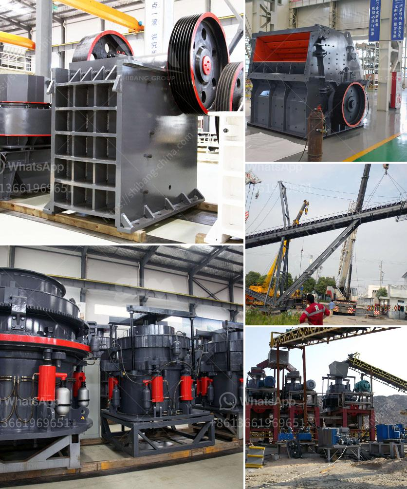

<h3>dry ball mill for silica powder</h3>
Dry ball mill, also known as dry type ball mill, is a kind of high efficient equipment for grinding material, which playing an important role in the beneficiation production line. It can be used for metal, non-ferrous metals and ferrous metals processing. Due to the excellent quality, it has a long working life. Moreover, it performs well in grinding various materials such as quartz, iron ore, copper ore, gold ore, cement clinker, glass etc.

For the dry ball mill, effective milling is important in order to get a desired particle size, which is usually in the range of 10 to 1000 microns. However, in recent years, the dry ball mill process has been gradually replaced by the wet ball mill process to promote the development of large-scale mining. Wet ball mill has a simple transportation device with less auxiliary equipment, so the investment is about 5%-10% lower than that of dry ball mill.

Dry ball mills have been widely used in cement, mining, chemical, metallurgical and other industries. However, the wet ball mill process is more suitable for grinding materials with higher water content, such as ore, cement, construction aggregate, and so on. Therefore, the wet ball mill process has been welcomed by many beneficiation plants with the advantages of large capacity, high efficiency, low energy consumption and other benefits.

With the development of science and technology, the demand for silica powder is increasing, and the quality requirement is higher and higher. The requirement for ultrafine silica powder is increasing, and classifier technology also continues to improve. The traditional powder grinding equipment is not suitable for the production of high-purity silica powder, which overcomes the grit problem caused by mechanical grinding in the wet process.

1. Excellent working and driving performance: The dry ball mill has a larger diameter, less axial important parts, large capacity and continuous operation, which reduces the number of shaft repairs and the cost of maintenance.

2. Low energy consumption: Due to the adoption of advanced design concept, the dry ball mill has higher grinding efficiency, low energy consumption and fewer dust problems.

3. Easy operation: There is no need for special installation, foundation, and debugging, which brings great convenience for the production and transportation of the equipment.

4. Wide application range: Dry ball mill is widely used in various industries, such as cement, silicate products, new building materials, refractory materials, fertilizers, black and non-ferrous metal beneficiation, and glass-ceramic production industries.

In conclusion, the dry ball mill is favored by silica powder customers for its high safety and energy-saving. It is suitable for the grinding of various ores and other materials, and is widely used in mineral processing, building materials and chemical industries. With the progress of technology, the market demand for silica powder is increasing, which brings a new opportunity for the development of the dry ball mill industry.
<h3>Contact us</h3><ul><li><strong>Whatsapp:&nbsp;<a href="https://wa.me/8613661969651">+8613661969651</a></strong></li><li><a href="https://swt.shibang-china.com/?git&amp;zhl&amp;dry ball mill for silica powder"><strong>Online Service(chat now)</strong></a></li></ul><h3>Related</h3><ul><li><a href='roll mills supplier in karachi.md'>roll mills supplier in karachi</a></li><li><a href='rock quarry sizing process.md'>rock quarry sizing process</a></li><li><a href='ball mill machine india.md'>ball mill machine india</a></li><li><a href='pictures of copper ore mining nigeria.md'>pictures of copper ore mining nigeria</a></li><li><a href='ball mill for 15tphr capacity.md'>ball mill for 15tphr capacity</a></li></ul>