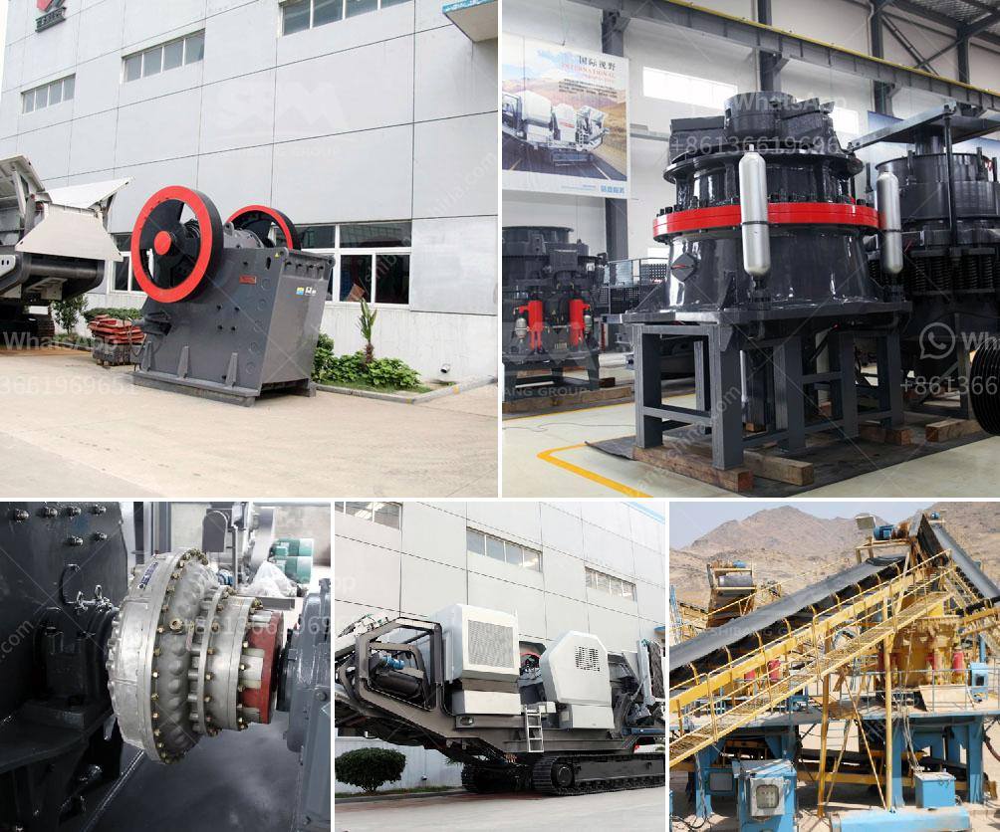

<h3>dry grinding ball mills for lime</h3>
Lime is one of the most versatile materials used in various industries, including construction, agriculture, and chemicals. It is obtained by heating limestone at high temperatures to remove carbon dioxide and produce quicklime or burnt lime. To further enhance its properties and ensure uniform distribution, lime is often processed using different grinding techniques. In this article, we will specifically focus on dry grinding ball mills for lime, exploring their benefits and applications.

Dry grinding ball mills, as the name suggests, are designed for grinding lime without the presence of water. They are equally effective for both wet and dry applications and provide advanced performance for consistent particle size distribution. These mills consist of a horizontal cylindrical shell that rotates on its axis. Inside the shell, the grinding media—usually steel balls or rods—are carefully placed. As the mill rotates, the media cascade and tumble, impacting and grinding the lime particles.

One of the primary advantages of dry grinding ball mills is their efficiency. These mills can grind lime to very fine particles, making them suitable for producing highly reactive lime for specialty applications. The fine grinding also helps in increasing the surface area of the lime particles, enhancing their reactivity with other materials. This is especially important when lime is used as a soil amendment or in the manufacturing of lime-based products.

Furthermore, dry grinding ball mills ensure a more uniform distribution of lime particles due to the absence of water. This helps in achieving consistent quality and performance, resulting in better product control and reduced variability. The controlled particle size distribution obtained from dry grinding also contributes to the uniformity of lime-based mixes and formulations, making them more predictable in various industrial processes.

Dry grinding ball mills offer numerous environmental benefits as well. Unlike wet grinding processes, dry grinding does not require the use of water and therefore eliminates the need for costly water management systems. This leads to significant water conservation, making it an attractive option for industries operating in water-scarce areas. Additionally, the absence of water minimizes the potential for corrosion and the formation of scale, extending the lifespan of the equipment.

The versatility of dry grinding ball mills for lime is another notable aspect. These mills are not limited to grinding lime rock alone; they can also efficiently grind other materials such as clinker, gypsum, and various ores. This enables their applicability in a wide range of industries, including cement manufacturing, mining, and metallurgy.

In conclusion, dry grinding ball mills for lime offer numerous advantages and applicability across various industries. Their efficiency, ability to produce fine particles, and uniform distribution make them ideal for specific applications requiring highly reactive lime. The environmental benefits, including water conservation and extended equipment lifespan, further add to their appeal. The versatility of dry grinding ball mills makes them an essential tool in the lime industry.
<h3>Contact us</h3><ul><li><strong>Whatsapp:&nbsp;<a href="https://wa.me/8613661969651">+8613661969651</a></strong></li><li><a href="https://swt.shibang-china.com/?git&amp;zhl&amp;dry grinding ball mills for lime"><strong>Online Service(chat now)</strong></a></li></ul><h3>Related</h3><ul><li><a href='100 tph hammer mill kenya.md'>100 tph hammer mill kenya</a></li><li><a href='grinding mill for sale in zimbabwe.md'>grinding mill for sale in zimbabwe</a></li><li><a href='crushing plant cost.md'>crushing plant cost</a></li><li><a href='new small gold processing equipment for sale in usa.md'>new small gold processing equipment for sale in usa</a></li><li><a href='philippines crusher cebu crusher.md'>philippines crusher cebu crusher</a></li></ul>