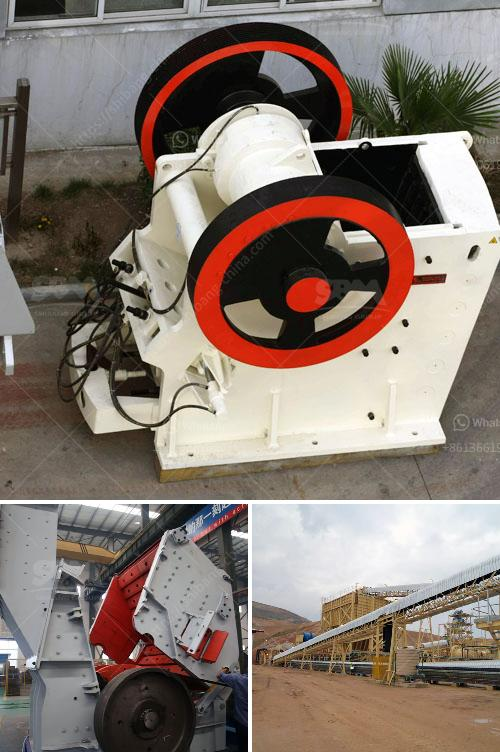

<h3>egypt gypsum powder manufacturer</h3>
In recent years, there has been a significant shift in the construction industry towards sustainable and eco-friendly building materials. One such material that has gained immense popularity is gypsum powder. Gypsum powder is a versatile material widely used in the construction sector due to its excellent fire resistance, sound insulation, and lightweight properties. Egypt gypsum powder manufacturers have emerged as a game-changer in the industry, providing high-quality gypsum powder to meet the growing demands of the market.

Egypt, with its rich gypsum reserves, has become a major exporter of gypsum powder in the global market. The country’s gypsum reserves are estimated to be over two billion tons, making it one of the largest gypsum producers globally. Egypt's unique climatic conditions and geological formations contribute to the high quality and purity of the gypsum produced in the region.

Egypt gypsum powder manufacturers leverage these abundant resources and advanced manufacturing techniques to produce superior-grade gypsum powder. They follow stringent quality control measures to ensure that their products meet international standards. The gypsum is processed through various stages, including crushing, grinding, calcination, and cooling, to achieve the desired quality and fineness.

One of the key advantages of Egyptian gypsum powder is its high purity. The natural gypsum found in Egypt is typically free from impurities, making it ideal for various applications. The purity of the gypsum contributes to its superior performance as a building material, providing durability and resistance to mold, moisture, and fire.

Egypt gypsum powder manufacturers cater to diverse industries, including construction, agriculture, cement, and art. In the construction sector, gypsum powder is widely used for wall plastering, jointing compounds, and decorative finishes. Its excellent fire resistance properties make it an ideal material for fireproofing and insulation. Gypsum powder is also used in the production of cement, acting as a retarder to control the setting time and enhance the properties of the product.

The agricultural sector is another significant consumer of gypsum powder. Its ability to improve soil structure, enhance water retention, and neutralize soil pH makes it a valuable soil amendment. Farmers in Egypt and around the world use gypsum powder to increase crop yields and improve plant growth.

As gypsum powder gains traction in various industries, the demand for Egypt gypsum powder manufacturers is on the rise. Their commitment to quality and innovation has made them sought-after suppliers globally. Egyptian gypsum powder is known for its consistency, reliability, and affordability, making it a preferred choice for contractors, builders, and manufacturers.

To meet the growing demand, Egypt gypsum powder manufacturers have invested in state-of-the-art technologies and expanded their production capacities. They have also adopted sustainable practices, ensuring minimal environmental impact during the mining and manufacturing processes. By implementing advanced machinery and adhering to strict quality control measures, they ensure consistency in the quality and supply of gypsum powder.

In conclusion, Egypt gypsum powder manufacturers have revolutionized the construction and manufacturing industries with their superior-quality gypsum powder. The country's rich gypsum reserves, coupled with advanced manufacturing techniques, have positioned Egypt as a leading exporter in the global market. As the world moves towards sustainable and eco-friendly construction materials, gypsum powder from Egypt is poised to continue its remarkable growth and dominance in the industry.
<h3>Contact us</h3><ul><li><strong>Whatsapp:&nbsp;<a href="https://wa.me/8613661969651">+8613661969651</a></strong></li><li><a href="https://swt.shibang-china.com/?git&amp;zhl&amp;egypt gypsum powder manufacturer"><strong>Online Service(chat now)</strong></a></li></ul><h3>Related</h3><ul><li><a href='crushing and screening for sale.md'>crushing and screening for sale</a></li><li><a href='roll crusher kenya.md'>roll crusher kenya</a></li><li><a href='wet process of cement production.md'>wet process of cement production</a></li><li><a href='limestone grinding raymond mill.md'>limestone grinding raymond mill</a></li><li><a href='grinding wet ball mill limestone.md'>grinding wet ball mill limestone</a></li></ul>