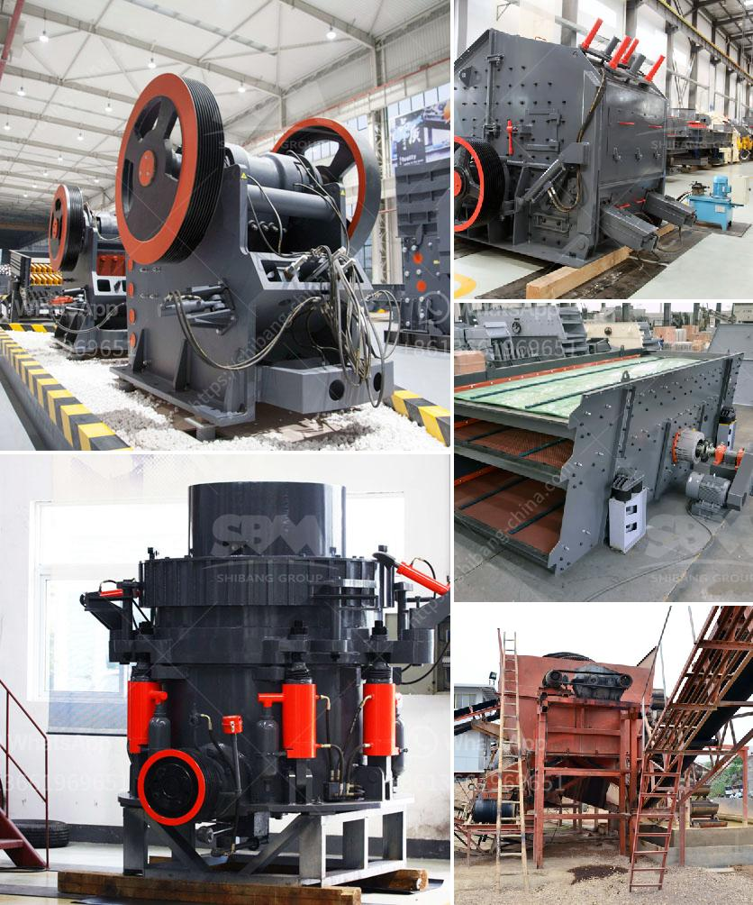

<h3>enquiry about cone crusher</h3>
A cone crusher is a crushing machine suitable for crushing materials of medium hardness. It is widely used in metallurgy, construction, road building, chemical and silicate industries. The cone crusher has the advantages of large crushing ratio, high efficiency, low energy consumption, uniform product size, and is suitable for medium and fine crushing of various ores and rocks.

When it comes to purchasing a cone crusher, several factors should be taken into consideration. This article aims to discuss the important aspects to keep in mind while submitting an enquiry about a cone crusher.

Firstly, the capacity and size requirements should be determined. The capacity of a cone crusher is generally measured by the amount of material that can be crushed per unit of time, usually expressed in tons per hour. It is important to assess the production requirements and choose a cone crusher with an appropriate capacity. Additionally, the size of the final product should also be considered. Different models of cone crushers have different size ranges, so it is crucial to specify the desired size range of the finished product.

Secondly, the type of cone crusher should be selected based on the specific needs. There are several types of cone crushers available in the market, such as spring cone crusher, hydraulic cone crusher, single-cylinder cone crusher, and multi-cylinder cone crusher. Each type has its own advantages and disadvantages. For example, a spring cone crusher is easy to use and maintain, but it may have lower production capacity compared to a hydraulic cone crusher. Therefore, it is important to thoroughly understand the characteristics of each type and choose the most suitable one for the application.

Thirdly, the quality and reliability of the cone crusher supplier should be assessed. It is crucial to select a reputable supplier that has a good reputation in the industry. A reliable supplier will provide high-quality cone crushers with excellent performance and durability. Additionally, they will offer comprehensive after-sales service and technical support, ensuring a smooth and trouble-free operation of the cone crusher.

Fourthly, the pricing and delivery terms should be clarified. It is important to inquire about the price of the cone crusher and compare it with other suppliers in the market. However, the price should not be the sole determining factor, as quality and performance are equally important. In addition, the delivery time and terms should be clearly discussed to avoid any potential delays or misunderstandings.

In conclusion, purchasing a cone crusher involves careful consideration of various factors. The capacity and size requirements, the type of cone crusher, the quality and reliability of the supplier, and the pricing and delivery terms should all be taken into account. By conducting a thorough enquiry and research, one can ensure the selection of a cone crusher that meets the specific needs and provides efficient and reliable crushing capabilities.
<h3>Contact us</h3><ul><li><strong>Whatsapp:&nbsp;<a href="https://wa.me/8613661969651">+8613661969651</a></strong></li><li><a href="https://swt.shibang-china.com/?git&amp;zhl&amp;enquiry about cone crusher"><strong>Online Service(chat now)</strong></a></li></ul><h3>Related</h3><ul><li><a href='talc rock crusher.md'>talc rock crusher</a></li><li><a href='gypsum mining plant.md'>gypsum mining plant</a></li><li><a href='grinding mill machine for sale.md'>grinding mill machine for sale</a></li><li><a href='china roller mill kenya.md'>china roller mill kenya</a></li><li><a href='gypsum powder production line manufacturers germany.md'>gypsum powder production line manufacturers germany</a></li></ul>