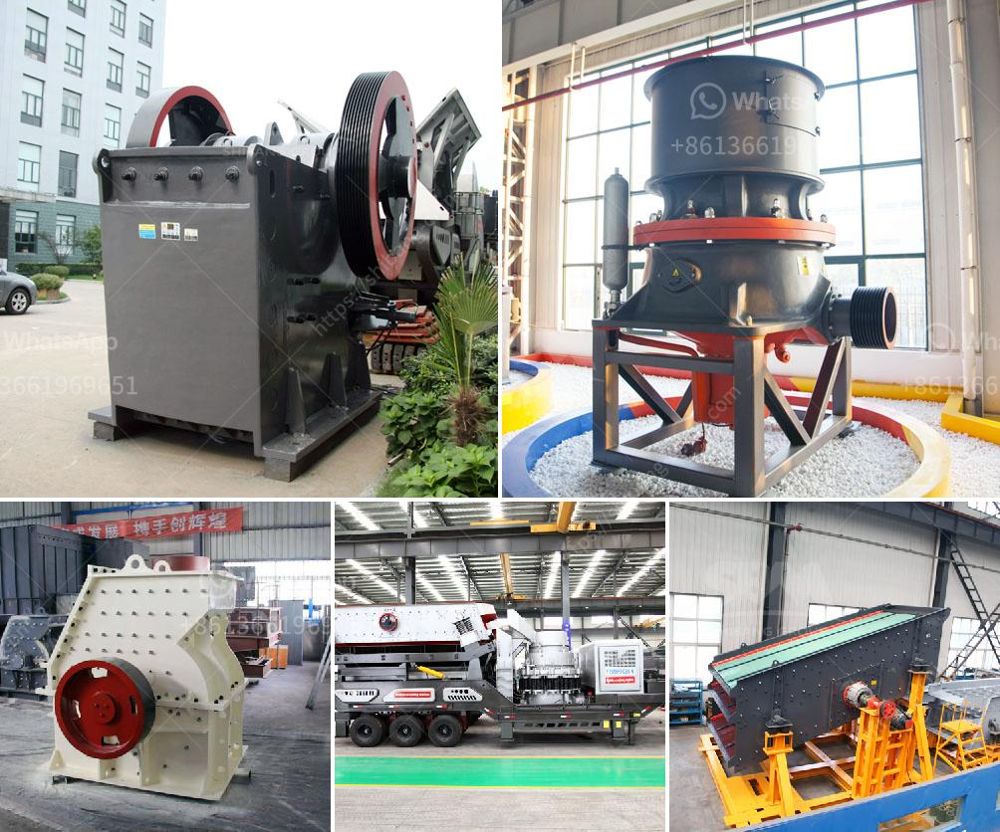

<h3>equipment mining grinding equipment for mezcal price</h3>
Mezcal, a traditional Mexican spirit derived from agave plants, has gained increased popularity among both connoisseurs and casual drinkers in recent years. As the demand for mezcal continues to rise, so does the need for efficient and cost-effective grinding equipment in the production process. This article explores the different types of mining grinding equipment available in the market and their price range.

When it comes to producing mezcal, the grinding process is crucial in extracting the flavors and aromas from the agave plants. This is where mining grinding equipment comes into play. There are various types of grinding equipment used in the mezcal production, including ball mills, hammer mills, and cone mills. These machines crush and grind the agave plants into a fine pulp, which is then fermented and distilled to create mezcal.

The price range of mining grinding equipment for mezcal can vary depending on factors such as the capacity, material, and brand. Generally, smaller and less expensive options are suitable for small-scale mezcal producers, while larger and more advanced equipment are used by larger-scale operations. Prices for grinding equipment range from $1,000 to $10,000 or more, depending on the equipment's quality and capacity.

It is worth noting that investing in high-quality grinding equipment is crucial for maximizing production efficiency and ensuring the quality of mezcal. While the initial cost may seem significant, the long-term benefits outweigh the upfront investment. Efficient grinding equipment facilitates a smooth and consistent grinding process, which ultimately leads to a higher yield and better flavor profile for the mezcal.

When considering grinding equipment for mezcal production, it is advisable to research and compare different brands and models to find the most suitable option for specific needs. Factors to consider include durability, ease of maintenance, and customer support provided by the manufacturer.

In conclusion, mining grinding equipment plays a crucial role in the production of mezcal. Its primary purpose is to crush and grind agave plants into a fine pulp, facilitating the extraction of flavors and aromas essential in mezcal's unique taste. The price range for grinding equipment can vary significantly, but investing in high-quality equipment is paramount for increased production efficiency and mezcal quality. Producers should conduct thorough research and consider different factors before choosing the most suitable grinding equipment for their mezcal production process.
<h3>Contact us</h3><ul><li><strong>Whatsapp:&nbsp;<a href="https://wa.me/8613661969651">+8613661969651</a></strong></li><li><a href="https://swt.shibang-china.com/?git&amp;zhl&amp;equipment mining grinding equipment for mezcal price"><strong>Online Service(chat now)</strong></a></li></ul><h3>Related</h3><ul><li><a href='hammer mill 25 ton hour.md'>hammer mill 25 ton hour</a></li><li><a href='stone crusher machine price in south africa.md'>stone crusher machine price in south africa</a></li><li><a href='conveyor belting manufacturers.md'>conveyor belting manufacturers</a></li><li><a href='ball mill price.md'>ball mill price</a></li><li><a href='used raymond grinding mill sale offer in pakistan.md'>used raymond grinding mill sale offer in pakistan</a></li></ul>