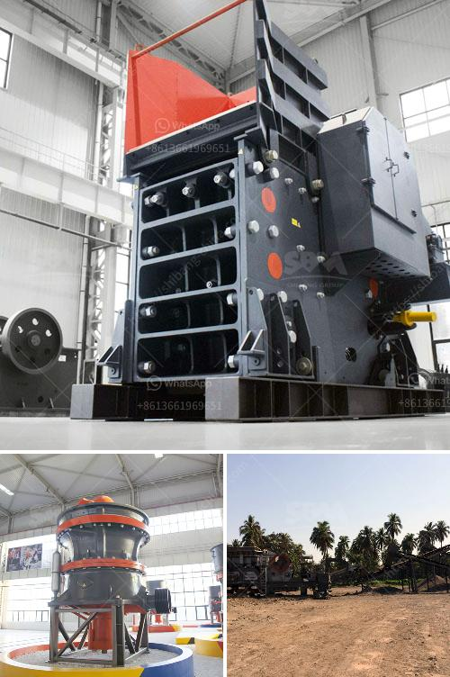

<h3>equipment necessary to exploiting a quarry</h3>
Quarries are essential sites for a variety of industries, including construction, mining, and landscaping. They provide the material needed to build roads, bridges, and buildings, as well as natural stone for decoration and functional purposes. However, successfully exploiting a quarry requires the right equipment to ensure efficiency, safety, and productivity. In this article, we will discuss some of the necessary equipment required for quarry exploitation.

1. Excavators: These heavy-duty machines are the backbone of any quarry operation. Excavators are used to remove topsoil and overburden, exposing the raw material beneath. They are available in various sizes, from compact to large models, their selection depending on the scale of the quarry. Generally, larger excavators are used for deeper excavations and moving heavier loads.

2. Bulldozers: Bulldozers are essential for pushing and piling large amounts of earth and rock. They can level uneven terrain and create roads used for transportation within the quarry. Bulldozers are equipped with a large blade at the front, making them ideal for straightforward tasks, such as clearing debris or pushing blasted rock into a designated area.

3. Crushers: Once the desired raw material has been exposed and extracted from the quarry, it needs to be crushed into smaller sizes for further processing. Various crushers, such as jaw crushers, impact crushers, and cone crushers, are used for this purpose. They break down the large rocks into more manageable pieces, ideal for transportation and subsequent use in concrete or asphalt production.

4. Wheel Loaders: Wheel loaders are used for loading the extracted material onto haul trucks, as well as for moving and stockpiling materials. They are particularly useful in quarries with uneven terrain, as they can maneuver easily and efficiently. Wheel loaders also play a crucial role in transferring quarried material from one location to another within the quarry site.

5. Haul Trucks: Haul trucks are vital for transporting quarried material to the processing area or loading dock. They come in various sizes, including rigid body and articulated trucks, with payload capacities ranging from a few tons to over 300 tons. Special attention should be given to selecting the appropriate truck size based on the volume and weight of the material being transported.

6. Drilling Equipment: Drilling is an essential process in the quarrying industry. It involves creating precise holes for explosive charges that facilitate the safe and efficient extraction of materials. Drilling equipment includes rotary drills and hammer drills, which utilize different mechanisms to create holes of various sizes and depths.

7. Screening Equipment: Once the raw material has been crushed, it often requires further separation and sizing. Screening equipment, including vibrating screens and trommel screens, is used to divide the crushed material into different sizes, ensuring that the final product meets specific requirements.

8. Dust Suppression Systems: Quarries generate a significant amount of dust during the extraction and processing of materials. Installing effective dust suppression systems, such as sprinklers or misting cannons, is crucial to protect the health and safety of workers and prevent air pollution.

In conclusion, operating a quarry successfully requires the use of specialized and efficient equipment. Excavators, bulldozers, crushers, wheel loaders, haul trucks, drilling equipment, screening equipment, and dust suppression systems are just some of the essential machinery necessary for quarry exploitation. Investing in high-quality equipment is crucial for optimizing productivity, ensuring worker safety, and maximizing the profitability of any quarry operation.
<h3>Contact us</h3><ul><li><strong>Whatsapp:&nbsp;<a href="https://wa.me/8613661969651">+8613661969651</a></strong></li><li><a href="https://swt.shibang-china.com/?git&amp;zhl&amp;equipment necessary to exploiting a quarry"><strong>Online Service(chat now)</strong></a></li></ul><h3>Related</h3><ul><li><a href='crushing plant turkey.md'>crushing plant turkey</a></li><li><a href='used crushers in germany for sale.md'>used crushers in germany for sale</a></li><li><a href='belt conveyor indonesia.md'>belt conveyor indonesia</a></li><li><a href='stone crushing in pakistan.md'>stone crushing in pakistan</a></li><li><a href='rock crusher production line.md'>rock crusher production line</a></li></ul>