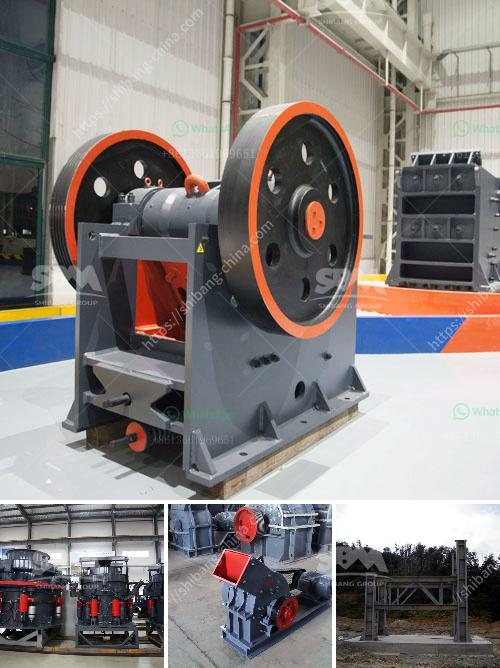

<h3>equipment of ball mill</h3>
The ball mill is a key piece of equipment for grinding crushed materials and it is widely used in production lines for powders such as cement, silicates, refractory material, fertilizer, glass ceramics, etc. as well as for ore dressing of both ferrous and non-ferrous metals.

The ball mill can grind various ores and other materials either wet or dry. There are two kinds of ball mills, grate type and overfall type, due to different ways of discharging material.

One of the key properties of grinding material is hardness and it usually determines the type of mill employed. There are many factors that can influence the hardness of the material including the structure and the composition of the material itself, as well as the way it is processed.

The ball mill is a machine that can grind medium-hard to extremely hard materials. The material to be ground fills the container partially and is then spun at a certain speed to generate a certain force and produce a certain grind. The hardness and the characteristics of the material being ground will determine the strategy to be used by the mill operator.

The equipment needed for grinding the material in a ball mill can vary depending on the material to be ground, as well as the specific requirements of the end product. Typical equipment includes grinding media, which can be steel balls or ceramics balls, depending on the hardness of the material being ground.

Another important factor is the size of the grinding media. The smaller the media size, the finer the grind. However, smaller media will have a lower impact force and will require more energy to grind the material. Larger media will have a higher impact force and will be able to grind the material more efficiently.

In addition to grinding media, a ball mill will also require liners to protect the inner shell of the rotating cylinder. Liners can be made of various materials, such as rubber, steel, or ceramic, depending on the type of material being ground and the desired output.

The design of the ball mill will also affect the productivity and efficiency of the grinding process. For example, the length and diameter of the mill will determine the residence time of the material inside the mill, which in turn affects the grind size.

Furthermore, the speed at which the mill rotates will also affect the grind size. Increasing the speed will increase the impact force, resulting in a finer grind. However, increasing the speed will also increase the power consumption of the mill.

In conclusion, the equipment required for grinding in a ball mill includes grinding media, liners, and the mill itself. The choice of equipment will depend on factors such as the hardness and characteristics of the material being ground, as well as the desired output. With the appropriate equipment, a ball mill can efficiently grind materials to the desired fineness and produce high-quality end products.
<h3>Contact us</h3><ul><li><strong>Whatsapp:&nbsp;<a href="https://wa.me/8613661969651">+8613661969651</a></strong></li><li><a href="https://swt.shibang-china.com/?git&amp;zhl&amp;equipment of ball mill"><strong>Online Service(chat now)</strong></a></li></ul><h3>Related</h3><ul><li><a href='i need a second hand mobile stone crusher south africa.md'>i need a second hand mobile stone crusher south africa</a></li><li><a href='manufactures hammer mills.md'>manufactures hammer mills</a></li><li><a href='china silica sand vibrating screen.md'>china silica sand vibrating screen</a></li><li><a href='ball mill manufacturer in philippines.md'>ball mill manufacturer in philippines</a></li><li><a href='copper concentrate plant equipment list.md'>copper concentrate plant equipment list</a></li></ul>