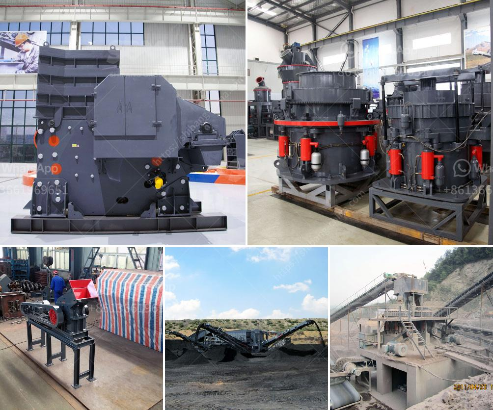

<h3>equipo del molino de bolas 750 hp precio del motor</h3>
El molino de bolas es una herramienta indispensable en la industria minera y de procesamiento de minerales. Este equipo se utiliza para moler o mezclar materiales para su uso posterior, como la extracción de minerales valiosos o la fabricación de productos químicos. Uno de los componentes más importantes del molino de bolas es su motor, y en este artículo nos enfocaremos en discutir el precio del motor de un equipo del molino de bolas de 750 HP.

El molino de bolas de 750 HP es un tamaño grande y se utiliza principalmente en operaciones mineras a gran escala. Este tipo de motor es capaz de proporcionar suficiente energía para impulsar el molino de bolas y moler grandes cantidades de material en un corto período de tiempo. Este nivel de potencia es necesario para garantizar una eficiencia adecuada en la operación y lograr los resultados deseados.

El precio del motor de un equipo del molino de bolas de 750 HP varía según diversos factores. Uno de los factores más importantes que afecta el precio es la marca y el fabricante del motor. Empresas de renombre y con una larga trayectoria en la fabricación de motores suelen tener precios más altos debido a la calidad y confiabilidad de sus productos. Sin embargo, esto no siempre significa que los motores más costosos sean siempre los mejores. Es importante investigar y comparar diferentes opciones antes de tomar una decisión final.

Otro factor a considerar es la disponibilidad y la demanda del motor. Si hay una alta demanda en el mercado, es probable que el precio sea más alto. Además, la ubicación y los costos de transporte también pueden afectar el precio final del motor. Si el motor debe ser importado o enviado a una ubicación remota, es posible que los costos de transporte sean significativamente más altos.

El motor de un equipo del molino de bolas de 750 HP puede oscilar entre los miles y los decenas de miles de dólares. Esto puede parecer una inversión significativa, pero es importante recordar que el molino de bolas es un equipo fundamental en la industria minera y puede generar grandes beneficios económicos si se utiliza adecuadamente.

Además del precio inicial del motor, también es importante considerar los costos de mantenimiento y operación a largo plazo. Es posible que se requiera un mantenimiento regular y reemplazo de piezas, lo que puede representar gastos adicionales.

En conclusión, el equipo del molino de bolas de 750 HP es esencial en la industria minera y su motor es uno de los componentes más importantes. El precio del motor puede variar según la marca, el fabricante, la demanda y los costos de transporte. Si bien puede representar una inversión significativa, es importante evaluar tanto los beneficios a largo plazo como los costos de mantenimiento y operación antes de tomar una decisión final.
<h3>Contact us</h3><ul><li><strong>Whatsapp:&nbsp;<a href="https://wa.me/8613661969651">+8613661969651</a></strong></li><li><a href="https://swt.shibang-china.com/?git&amp;zhl&amp;equipo del molino de bolas 750 hp precio del motor"><strong>Online Service(chat now)</strong></a></li></ul><h3>Related</h3><ul><li><a href='brick crusher for sale.md'>brick crusher for sale</a></li><li><a href='company where they sell industrial mills.md'>company where they sell industrial mills</a></li><li><a href='bauxite beneficiation plant.md'>bauxite beneficiation plant</a></li><li><a href='feldspar ball mills manufacturers.md'>feldspar ball mills manufacturers</a></li><li><a href='stone crusher plant machinery.md'>stone crusher plant machinery</a></li></ul>