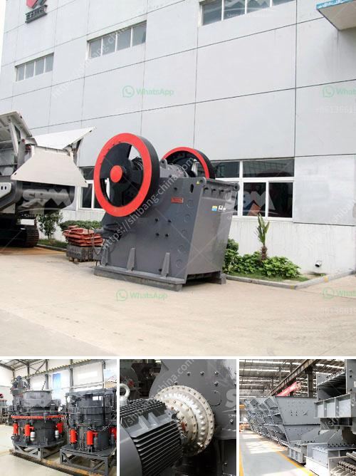

<h3>estimated cost of building a steel mill</h3>
The estimated cost of building a steel mill can vary greatly depending on the size, complexity, and location of the project. As a rough guideline, a basic steel mill with a capacity of producing one million metric tons of steel per year can cost around $1 billion. This includes the machinery, land, and infrastructure costs.

However, it is important to note that the actual cost of building a steel mill can be significantly higher or lower than this estimate. Several factors contribute to these cost variations. For example, the price of raw materials such as iron ore and coal can greatly impact the investment required. Infrastructure costs, such as transportation and utility access, also play a vital role.

Additionally, the location of the steel mill is a crucial factor. Setting up a mill in a developed area with existing infrastructure and skilled labor force can be more cost-effective. On the other hand, constructing a mill in a remote, undeveloped region may involve substantial expenses for building roads, power supply, and employee housing.

The complexity of the project also influences the cost. Advanced technologies and sophisticated equipment can significantly increase the investment required. Furthermore, environmental compliance measures, such as pollution control systems, can add to the overall cost.

It is worth mentioning that aside from the initial construction cost, operating and maintenance expenses are ongoing considerations. These costs include labor, energy, raw material procurement, and maintenance of machinery. Careful planning and meticulous estimation are essential to ensure profitability in the long run.

Ultimately, precise estimates for building a steel mill can only be determined after careful evaluation of the project specifics, market conditions, and feasibility studies. A comprehensive cost analysis, taking into account various elements, is crucial in order to make informed decisions and secure investments for such a significant industrial undertaking.
<h3>Contact us</h3><ul><li><strong>Whatsapp:&nbsp;<a href="https://wa.me/8613661969651">+8613661969651</a></strong></li><li><a href="https://swt.shibang-china.com/?git&amp;zhl&amp;estimated cost of building a steel mill"><strong>Online Service(chat now)</strong></a></li></ul><h3>Related</h3><ul><li><a href='impact rock crusher.md'>impact rock crusher</a></li><li><a href='portable crusher in philippines.md'>portable crusher in philippines</a></li><li><a href='gravel gravel and sand mining equipment.md'>gravel gravel and sand mining equipment</a></li><li><a href='crusher material for stone.md'>crusher material for stone</a></li><li><a href='hammer mills semarang.md'>hammer mills semarang</a></li></ul>