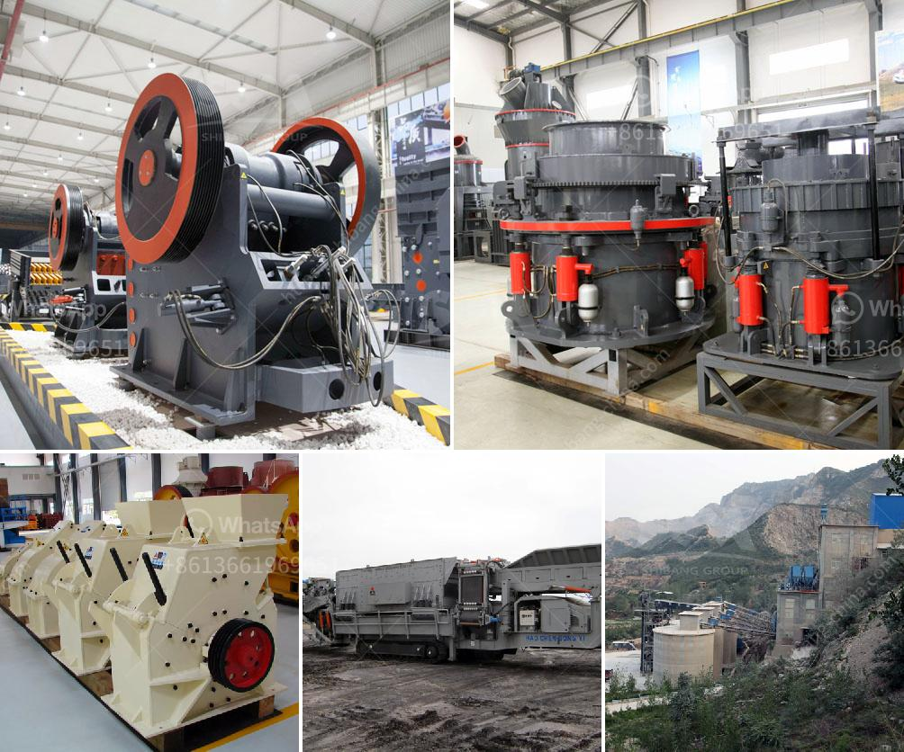

<h3>ethiopia gypsum manufacturers</h3>
Ethiopia has a rapidly growing construction industry, and gypsum products play a vital role in its development. Gypsum is a mineral commonly used in the production of cement, plaster, and drywall. In recent years, the demand for these products has surged, leading to an increase in the number of gypsum manufacturers in Ethiopia.

One prominent player in the Ethiopian gypsum industry is XYZ Company. XYZ has been in operation for over a decade and has established itself as a leading manufacturer of gypsum products in the country. The company operates a state-of-the-art production facility equipped with modern machinery and employs a skilled workforce to ensure high-quality products.

XYZ Company offers a wide range of gypsum products that meet the diverse needs of the construction industry. Their product portfolio includes gypsum plaster, which is widely used in the finishing of walls and ceilings, as well as gypsum boards, commonly known as drywall, which are extensively utilized for interior partitions.

Apart from meeting local demand, XYZ Company also exports its products to neighboring countries, further contributing to Ethiopia's economy. The company's commitment to quality, competitive pricing, and efficient customer service has helped establish it as a trusted name among contractors, developers, and individuals alike.

In addition to XYZ Company, there are several other gypsum manufacturers in Ethiopia, which collectively cater to the growing demand for gypsum products. This increased competition has led to better quality products and more affordable pricing options for consumers.

The expansion of the gypsum industry in Ethiopia has not only resulted in economic growth but has also created job opportunities for the local population. The establishment of manufacturing facilities and the subsequent hiring of workers have helped alleviate poverty and improve livelihoods.

As the construction industry continues to thrive, the demand for gypsum products is expected to escalate. This presents an excellent opportunity for gypsum manufacturers in Ethiopia to expand their operations and invest in research and development to further improve the quality and range of their products.

In conclusion, the gypsum industry in Ethiopia is flourishing, driven by the rapid growth of the construction sector. Manufacturers like XYZ Company are at the forefront of meeting this demand, offering high-quality gypsum products that contribute to the development of the country's infrastructure. With continued investments and innovations, Ethiopia has the potential to become a regional hub for gypsum production and export in the foreseeable future.
<h3>Contact us</h3><ul><li><strong>Whatsapp:&nbsp;<a href="https://wa.me/8613661969651">+8613661969651</a></strong></li><li><a href="https://swt.shibang-china.com/?git&amp;zhl&amp;ethiopia gypsum manufacturers"><strong>Online Service(chat now)</strong></a></li></ul><h3>Related</h3><ul><li><a href='france roller mills.md'>france roller mills</a></li><li><a href='bradley grinding mill price.md'>bradley grinding mill price</a></li><li><a href='rock crushing machine price.md'>rock crushing machine price</a></li><li><a href='oman marble quarry companies.md'>oman marble quarry companies</a></li><li><a href='manufactures hammer mills.md'>manufactures hammer mills</a></li></ul>