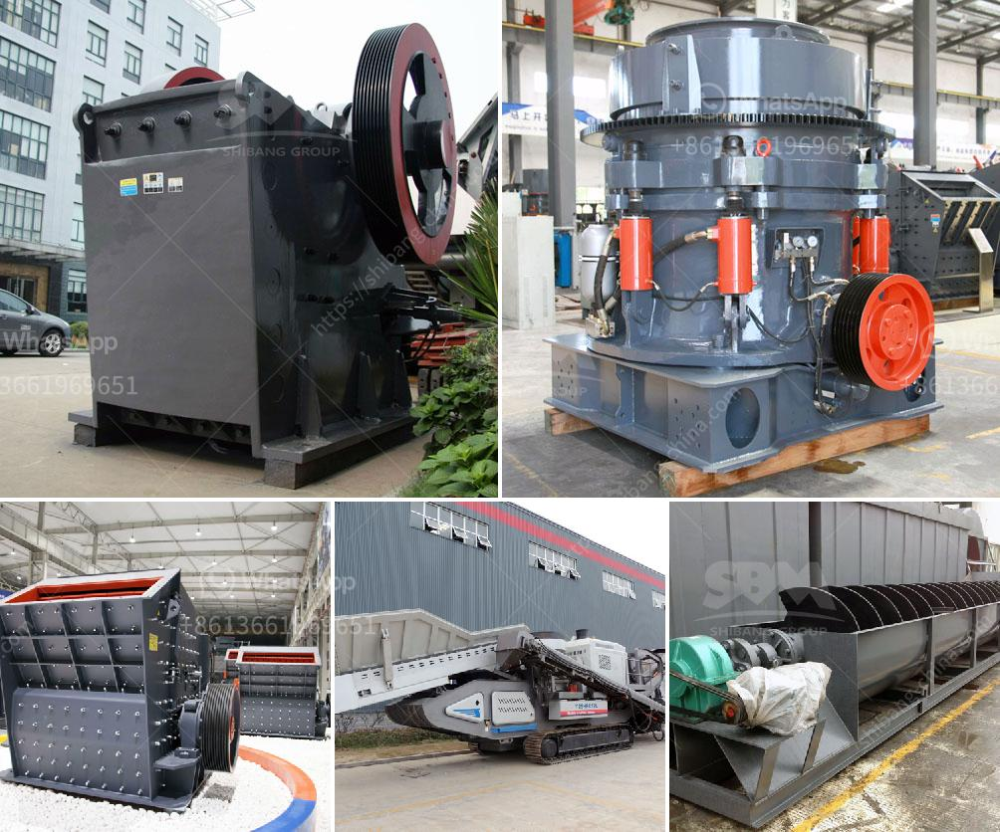

<h3>ethiopia stone crusher suppliers</h3>
Ethiopia is a landlocked country in the Horn of Africa. It is bordered on the north by Eritrea, on the northeast by Djibouti and Somalia, on the east by Kenya, and on the south and southwest by South Sudan and Sudan. Ethiopia has a population of over 112 million, making it the second-most populous country in Africa.

As a developing country, Ethiopia is experiencing rapid industrialization and construction. One key aspect of this growth is the construction sector. With infrastructure projects like roads, bridges, and buildings on the rise, there is a high demand for construction materials, including stone aggregates.

Stone crusher suppliers play a vital role in the production of crushed stone aggregates. These suppliers provide the machinery needed to convert large rocks into small stones for construction purposes. They also help in producing high-quality raw materials for other industries such as cement production and asphalt manufacturing.

Ethiopia stone crusher suppliers have always strived to provide excellent products and sincere services for the customers. These suppliers not only have a strong supply capacity but also have a very high reputation in the market. Their stone crusher machines not only have high quality but also have excellent performance.

The main types of crushers offered by Ethiopian suppliers include jaw crushers, impact crushers, cone crushers, hammer crushers, and portable crushers. With excellent technology and high-quality equipment, these crushers can efficiently complete various crushing tasks.

Ethiopian stone crusher suppliers aim to meet the specific needs of customers and deliver high-quality products tailored to their requirements. They also provide comprehensive after-sales service and technical support to ensure the smooth operation of the stone crushing process.

In conclusion, Ethiopian stone crusher suppliers are trusted and reliable manufacturers who strive to provide high-quality products and excellent services to meet the growing demand for stone aggregates in the country's construction sector. Their dedication to customer satisfaction and their commitment to innovation make them valuable partners in Ethiopia's development journey.
<h3>Contact us</h3><ul><li><strong>Whatsapp:&nbsp;<a href="https://wa.me/8613661969651">+8613661969651</a></strong></li><li><a href="https://swt.shibang-china.com/?git&amp;zhl&amp;ethiopia stone crusher suppliers"><strong>Online Service(chat now)</strong></a></li></ul><h3>Related</h3><ul><li><a href='ball mill suppliers china.md'>ball mill suppliers china</a></li><li><a href='ball mill plant manufacturers.md'>ball mill plant manufacturers</a></li><li><a href='rock crusher gravel production.md'>rock crusher gravel production</a></li><li><a href='brick making business plan pdf.md'>brick making business plan pdf</a></li><li><a href='dolomite crushing machine mill.md'>dolomite crushing machine mill</a></li></ul>