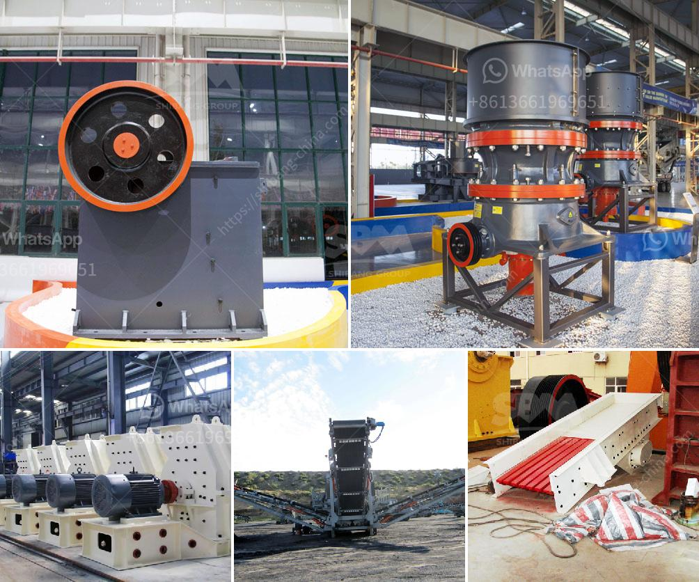

<h3>ethiopia stone crushing industry</h3>
The construction industry is a promising sector in Ethiopia that has been showing impressive growth in recent years. The stone crushing industry serves as a vital segment of the economy in Ethiopia, contributing towards economic growth, job creation, and poverty alleviation. It also plays a crucial role in building Ethiopia's infrastructure, generating revenue, and generating employment opportunities.

Stone crushing industry is an important industrial sector engaged in producing crushed stone (metal aggregates) of various sizes, used in construction as road base, stone chips for building and construction, retaining wall blocks, concrete mix, and asphalt for road and civil construction projects.

Over the years, the construction industry in Ethiopia has been increasing at a rapid pace, adding to the demand for crushed stone aggregates. The stone crushing equipment market is witnessing the emergence of mobile crushing machines that can function in demanding environments. For instance, in April 2018, announced the launch of its new impact crushers at Intermat Paris, which are suitable for demolition, quarrying, and recycling applications.

The growing construction industry in Ethiopia has led to increased demand for construction materials, including stone aggregates. Stone crushing industry plays a vital role in the economy and urban development of fast-growing cities such as Addis Ababa, Dire Dawa, Jimma, Mek'ele, and Bahir Dar. In these cities, approximately 50,000 people are directly involved in the industry, which generates income for them and contributes to the local economy.

Furthermore, the stone crushing industry also provides employment opportunities for hundreds of thousands of people in rural areas where there are limited employment opportunities. Many small-scale stone crushing businesses operate in these areas. These businesses employ a significant number of people, including women and youth, providing them with a source of income to support their families and improve their living standards.

The stone crushing industry in Ethiopia also generates vast amounts of waste materials. These waste materials have the potential to be used as aggregate substitutes to save natural resources and minimize waste accumulation. Recycling waste materials from stone crushing units would decrease the environmental impact and associated health hazards caused by quarrying activities.

However, the stone crushing industry in Ethiopia faces several challenges due to lack of infrastructure and processing capacity. Large stone crushing units are scattered all over the country and are not concentrated in one area, creating irregularities in regulation enforcement. Mining in Ethiopia is regulated by several legislations, including the Mining Proclamation and the Investment Proclamation. Despite these regulations, there is still a high prevalence of unlicensed and illegal stone crushing units that damage the environment and put the lives of workers at risk.

The Ethiopian government should focus on strengthening the regulation and enforcement mechanisms to ensure that stone crushing activities are conducted in an environmentally friendly and sustainable manner. It should also encourage investment in the stone crushing industry to boost its potential and make it more competitive. Additionally, the government should support research and innovation in the stone crushing sector to develop new technology and techniques that would improve productivity and efficiency.

To sum up, the stone crushing industry in Ethiopia is a promising investment opportunity for the construction and infrastructure development sectors. With the country's rapidly growing population, urbanization, and increasing demand for construction materials, the sector offers significant potential for employment generation, economic growth, and poverty reduction. However, to fully harness the potential of the industry, the Ethiopian government must address the challenges it faces and create a conducive environment for its sustainable development.
<h3>Contact us</h3><ul><li><strong>Whatsapp:&nbsp;<a href="https://wa.me/8613661969651">+8613661969651</a></strong></li><li><a href="https://swt.shibang-china.com/?git&amp;zhl&amp;ethiopia stone crushing industry"><strong>Online Service(chat now)</strong></a></li></ul><h3>Related</h3><ul><li><a href='crusher price rock crusher price 8mm.md'>crusher price rock crusher price 8mm</a></li><li><a href='mobile gold processing plant for sale in south africa.md'>mobile gold processing plant for sale in south africa</a></li><li><a href='sand washing plants in india.md'>sand washing plants in india</a></li><li><a href='coal powder making process.md'>coal powder making process</a></li><li><a href='what is cost for 50 tpd cement plant.md'>what is cost for 50 tpd cement plant</a></li></ul>