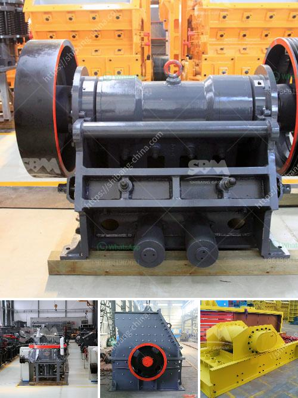

<h3>ethiopia unused cone crusher for sale</h3>
Ethiopia is known for its impressive agriculture, ancient history, and vibrant culture. However, one industry that often goes unnoticed is the mining industry. With vast mineral resources such as gold, platinum, and tantalum, Ethiopia has the potential to become a leading player in the global mining market. One essential equipment in this industry is the cone crusher.

A cone crusher is a machine that breaks rocks by squeezing them between an eccentrically gyrating cone (mantle) and a concave hopper. Rocks enter the crusher from the top, and the bottom opening allows crushed rocks to exit. Cone crushers are widely used in various mining and stone crushing industries.

In Ethiopia, a cone crusher is crucial for infrastructure projects such as road construction, bridge construction, and power projects. However, there has been no significant market for cone crushers in the country. As a result, many cone crushers are underutilized or even remain unused.

There are several reasons why cone crushers in Ethiopia are not fully utilized. First and foremost, the lack of awareness and knowledge about cone crushers is a major issue. Many professionals in the mining industry are unfamiliar with the benefits and advantages of cone crushers, leading to a limited demand.

Another reason for the underutilization of cone crushers in Ethiopia is the lack of skilled technicians and operators. Cone crushers require specialized maintenance and operation knowledge to maximize their performance. Without adequately trained individuals, the crushers may not function optimally, discouraging their usage.

Furthermore, the availability of spare parts is a significant challenge in Ethiopia. Cone crushers, like any other machinery, require regular maintenance and replacement of worn-out parts. However, the absence of local suppliers for cone crusher spare parts forces many operators to halt their equipment when parts need to be replaced.

To address these issues and encourage the use of cone crushers in Ethiopia, the government and industry stakeholders must take certain steps. First, awareness campaigns and training programs should be organized to educate mining professionals about the benefits of cone crushers and how to effectively use and maintain them.

Additionally, efforts should be made to import and stock an adequate supply of cone crusher spare parts. Collaboration with international suppliers and manufacturers can ensure the availability of spare parts locally, reducing the downtime caused by equipment maintenance.

Moreover, creating a skilled workforce by offering training programs and courses on cone crusher operation and maintenance would be a significant investment. By equipping local technicians with expertise in cone crusher maintenance, the mining industry can overcome the barriers to utilizing this essential equipment.

In conclusion, Ethiopia has vast mineral resources, making the mining industry highly promising. However, the underutilization of cone crushers in the country hinders the industry's progress. With adequate awareness, training, and the availability of spare parts, the potential of cone crushers can be fully realized in Ethiopia. Investing in these areas will not only benefit the mining industry but also contribute to the country's overall economic growth.
<h3>Contact us</h3><ul><li><strong>Whatsapp:&nbsp;<a href="https://wa.me/8613661969651">+8613661969651</a></strong></li><li><a href="https://swt.shibang-china.com/?git&amp;zhl&amp;ethiopia unused cone crusher for sale"><strong>Online Service(chat now)</strong></a></li></ul><h3>Related</h3><ul><li><a href='small scale copper refining equipment.md'>small scale copper refining equipment</a></li><li><a href='price of central vertical roller mill.md'>price of central vertical roller mill</a></li><li><a href='feasibility study for cocoa unit processing.md'>feasibility study for cocoa unit processing</a></li><li><a href='stone crusher mini.md'>stone crusher mini</a></li><li><a href='chinese ore processing plants.md'>chinese ore processing plants</a></li></ul>