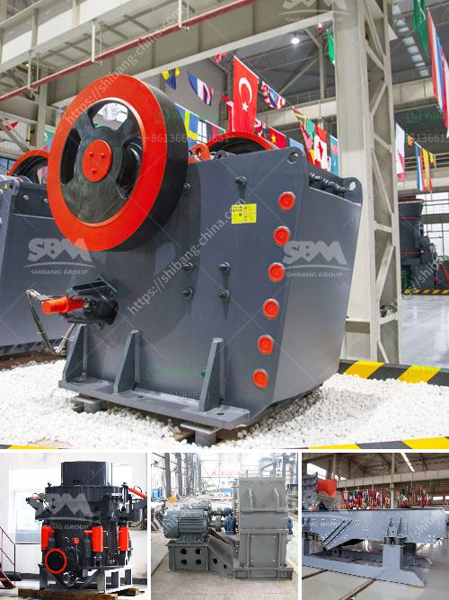

<h3>feasibility report for black stone crushers in jharkhand</h3>
Jharkhand is located in the eastern part of India. The state shares its borders with West Bengal in the east, Uttar Pradesh and Chhattisgarh in the west, Bihar in the north, and Odisha in the south. In India, Jharkhand is one of the leading states in terms of economic growth. The GSDP (Gross State Domestic Product) of Jharkhand was estimated to be around USD 21.7 billion in 2020-21. One of the key sectors contributing to this economic growth is the mining and quarrying sector.

Black stone mining is one of the major activities in the Indian state of Jharkhand. The availability of high-quality black stones in abundance has made it a lucrative business option for entrepreneurs and individuals. To meet the growing demand for black stones, there are various black stone mining sites in different parts of the state.

The objective of this study is to assess the viability and feasibility of establishing black stone crushing units in the state of Jharkhand. The baseline information related to the existing black stone crushing units in the state, their production capacity, and the existing policies surrounding their establishment is collected and analyzed. Based on this analysis, recommendations will be provided for potential investors to help them make informed decisions.

1. Data Collection: Primary data is collected from various sources such as government records, industry experts, and stakeholders. The information includes details about the existing black stone crushing units, their production capacity, land area, and location.

2. Analysis: The collected data is then analyzed to identify the current situation in the black stone crushing industry in Jharkhand. This analysis will include market trends, drivers, challenges, and potential opportunities for the black stone crusher industry in the state.

3. Recommendations: Based on the analysis, recommendations will be provided for potential investors looking to start black stone crushing units in Jharkhand. This includes suggestions for suitable locations, investment required, machinery selection, and regulatory compliance.

- The black stone crusher industry in Jharkhand is increasing rapidly due to high demand for stones used in construction purposes.

- The government provides various policies and incentives to encourage the establishment of the black stone crusher units.

- Some of the prominent players in the black stone crushing industry in Jharkhand include Singh Stone Quarry, Sahay Stone Quarry, Khadans Stone Quarry, and Ram Stone Quarry.

The feasibility study conducted suggests that the establishment of black stone crusher units in Jharkhand is economically viable and beneficial for the local population. The investment made in crushers will not only provide employment opportunities but also promote economic development in the state.

Furthermore, the demand for black stones is expected to increase in the coming years due to the growth of the construction sector. Thus, potential investors should carefully consider the recommendations provided in this feasibility report and explore the opportunities available in this sector in Jharkhand.
<h3>Contact us</h3><ul><li><strong>Whatsapp:&nbsp;<a href="https://wa.me/8613661969651">+8613661969651</a></strong></li><li><a href="https://swt.shibang-china.com/?git&amp;zhl&amp;feasibility report for black stone crushers in jharkhand"><strong>Online Service(chat now)</strong></a></li></ul><h3>Related</h3><ul><li><a href='ball mill manufactures in zimbabwe.md'>ball mill manufactures in zimbabwe</a></li><li><a href='aggregates crushing plant assembly in china.md'>aggregates crushing plant assembly in china</a></li><li><a href='gravel crushers for sale in manila philippines.md'>gravel crushers for sale in manila philippines</a></li><li><a href='rock crusher dust fog control system philippines.md'>rock crusher dust fog control system philippines</a></li><li><a href='stone crushers from china.md'>stone crushers from china</a></li></ul>