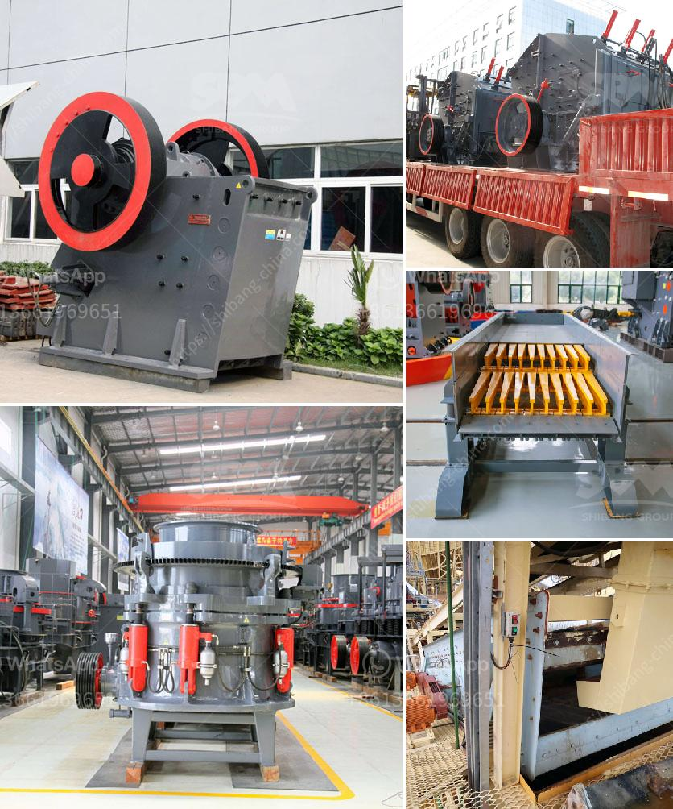

<h3>feasibility studies on lead ore processing</h3>
Lead ore, a naturally occurring mineral, has been a crucial resource for human civilization for thousands of years. From ancient architecture to modern industries, lead has been used in a wide range of applications. However, the processing of lead ore requires careful consideration and meticulous planning to ensure its feasibility and sustainability.

A feasibility study is a detailed investigation conducted to evaluate the potential of a project, determining whether it is technically, economically, and financially viable. When it comes to lead ore processing, a feasibility study plays a crucial role in understanding the various factors involved in the extraction, beneficiation, and utilization of this valuable resource.

First and foremost, a feasibility study focuses on the technical aspects of lead ore processing. It involves evaluating the available lead ore deposits, their characteristics, and the potential mining and extraction methods. This includes assessing the ore grade and mineralogy, as well as the geology of the deposit, to determine the most effective and efficient processing techniques.

Furthermore, a feasibility study examines the environmental impact of lead ore processing. It involves evaluating the potential environmental risks and devising strategies to mitigate them. These strategies may include implementing pollution control measures, waste management practices, and reclamation plans to ensure the responsible and sustainable utilization of the lead ore resource.

In addition to the technical and environmental aspects, a feasibility study also considers the economic viability of lead ore processing. It involves evaluating the market demand and prices for lead, assessing the production costs, and determining the potential profitability of the project. Factors such as transportation, energy requirements, labor costs, and regulatory compliance also play a significant role in assessing the economic feasibility of lead ore processing.

Conducting a feasibility study for lead ore processing is essential for informed decision-making by investors and stakeholders. It provides a comprehensive understanding of the potential risks, challenges, and opportunities associated with the project. By carefully evaluating the technical, environmental, and economic aspects, a feasibility study helps in minimizing uncertainties and maximizing the chances of project success.

Moreover, a feasibility study on lead ore processing enables the identification of potential bottlenecks and the development of effective strategies to overcome them. It ensures that all necessary permits and compliance requirements are met, preventing costly delays or legal issues. By addressing potential challenges in advance, a feasibility study allows project developers to make informed decisions and optimize the overall project design.

In conclusion, feasibility studies on lead ore processing play a vital role in unlocking the potential of this valuable resource in a sustainable and responsible manner. These studies evaluate the technical, environmental, and economic aspects of the project, ensuring its viability and minimizing uncertainties. By conducting a comprehensive feasibility study, investors and stakeholders can make informed decisions, optimize project design, and maximize the chances of successful lead ore processing.
<h3>Contact us</h3><ul><li><strong>Whatsapp:&nbsp;<a href="https://wa.me/8613661969651">+8613661969651</a></strong></li><li><a href="https://swt.shibang-china.com/?git&amp;zhl&amp;feasibility studies on lead ore processing"><strong>Online Service(chat now)</strong></a></li></ul><h3>Related</h3><ul><li><a href='ball mill in copper plant.md'>ball mill in copper plant</a></li><li><a href='stone crusher plant manufacturers.md'>stone crusher plant manufacturers</a></li><li><a href='stone crushers gold.md'>stone crushers gold</a></li><li><a href='gold wash plant for sale canada.md'>gold wash plant for sale canada</a></li><li><a href='stone crusher plants peru.md'>stone crusher plants peru</a></li></ul>