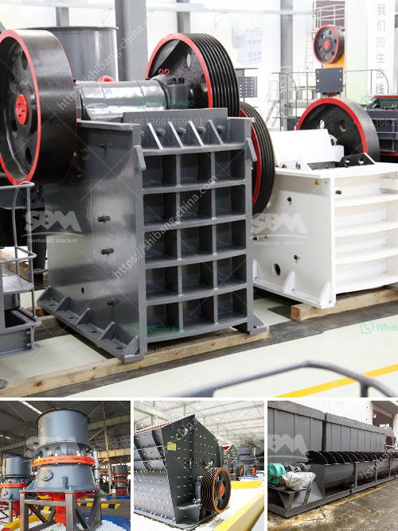

<h3>feasibility study for cocoa unit processing</h3>
Cocoa, also known as the "food of the gods," has been a highly sought-after commodity for centuries. The humble cocoa bean is the key ingredient in chocolate, a beloved treat enjoyed by millions around the world. With the increasing demand for chocolate products, investing in a cocoa unit processing facility can be a lucrative opportunity. However, before venturing into this venture, it is essential to conduct a feasibility study to assess the viability and potential success of such a project.

A feasibility study serves as a roadmap for potential investors, outlining the necessary steps and considerations to ensure the success of the cocoa unit processing facility. The study involves an in-depth analysis of various factors, including market demand, financial viability, competition, supply chain management, and regulatory requirements.

One crucial aspect of the feasibility study is assessing market demand. Investors need to consider the current and future demand for cocoa and its derived products. Researching market trends, consumer preferences, and projected growth can provide insights into the potential success of the cocoa unit processing facility.

Financial viability is another key factor to consider. The feasibility study should evaluate the financial aspects of the project, including the initial investment required, operational costs, and revenue projections. It is important to carefully analyze the market prices of cocoa, processing costs, and potential profit margins to determine the feasible financial outcome.

Competition analysis is essential to assess the market landscape and identify potential challenges. Understanding the existing players, their production capacity, product range, and market share can help determine the feasibility and competitiveness of the cocoa unit processing facility. Identifying unique selling propositions or niche markets can offer a competitive advantage in the industry.

Supply chain management is a critical component of the cocoa unit processing facility. The feasibility study should address the entire supply chain, from sourcing cocoa beans to processing, packaging, and distribution. Examining potential suppliers, their reliability, cost, and quality of cocoa beans is crucial for ensuring a consistent supply. Additionally, considering the logistics and transportation requirements is essential for streamlining operations.

Regulatory requirements and compliance play a significant role in the feasibility study. Investors must investigate the necessary permits, licenses, and certifications required to operate a cocoa unit processing facility. Understanding the regulatory landscape is essential for avoiding legal and operational issues down the line.

In conclusion, conducting a feasibility study for a cocoa unit processing facility is a crucial step in ensuring the success of the project. Assessing market demand, financial viability, competition, supply chain management, and regulatory requirements provides essential insights for potential investors. By meticulously analyzing these factors, investors can make informed decisions and strategically plan the establishment and operation of a cocoa unit processing facility. With proper planning and execution, this venture can offer a satisfying return on investment while contributing to the delightful world of chocolate.
<h3>Contact us</h3><ul><li><strong>Whatsapp:&nbsp;<a href="https://wa.me/8613661969651">+8613661969651</a></strong></li><li><a href="https://swt.shibang-china.com/?git&amp;zhl&amp;feasibility study for cocoa unit processing"><strong>Online Service(chat now)</strong></a></li></ul><h3>Related</h3><ul><li><a href='limestone crusher rotor mechanical.md'>limestone crusher rotor mechanical</a></li><li><a href='sale of ball mills used in peru.md'>sale of ball mills used in peru</a></li><li><a href='coal vibrating screen manufacturers in south africa.md'>coal vibrating screen manufacturers in south africa</a></li><li><a href='ball mill shell materials.md'>ball mill shell materials</a></li><li><a href='definivion jaw crusher.md'>definivion jaw crusher</a></li></ul>