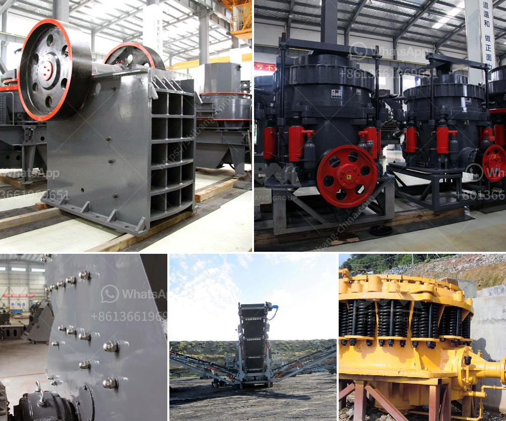

<h3>feeders for hammer mills</h3>
Hammer mills are widely used in various industries, including agriculture, mining, and pharmaceuticals, for grinding and shredding materials. These powerful machines rely on a steady supply of materials to operate effectively, making feeders a crucial component in their functioning. Feeders are responsible for delivering the raw materials to the hammer mill, ensuring the continuous, efficient, and reliable operation of the entire system.

One of the main advantages of utilizing feeders for hammer mills is their ability to control the flow of materials. By regulating the feeding rate, feeders prevent overloading and clogging, allowing the hammer mill to function optimally. This leads to improved efficiency, reduced downtime, and increased productivity. Additionally, accurate control over the feeding rate enables operators to achieve consistent particle size distribution, essential in industries where the final product's quality is of utmost importance.

Feeders for hammer mills come in various forms, including vibrating feeders, belt feeders, and screw feeders. Each type has its unique advantages that cater to different applications and material characteristics. For instance, vibrating feeders are commonly used in applications where a continuous and controlled flow is required. On the other hand, belt and screw feeders are preferred for transporting materials with higher abrasiveness or bulk density.

In addition to their role in controlling the raw material flow, feeders for hammer mills also contribute to the overall safety of the system. In industries dealing with hazardous or explosive materials, specially designed feeders equipped with explosion-proof features can ensure the protection of personnel and equipment.

Furthermore, the integration of advanced technologies, such as automation and remote monitoring capabilities, into feeders for hammer mills enhances their efficiency and ease of use. Automated feeding systems can be programmed to adjust the feeding rate based on specific parameters, eliminating the need for constant manual intervention. Remote monitoring capabilities allow operators to supervise and control the feeding process from a remote location, minimizing the risk of accidents and improving operational flexibility.

In conclusion, feeders for hammer mills play a critical role in ensuring the continuous, efficient, and productive operation of these powerful machines. Their ability to control the flow of materials, achieve consistent particle size distribution, and enhance safety makes them an indispensable component in various industries. As technology continues to advance, innovations in feeders for hammer mills are expected, further enhancing their performance and contributing to the overall success of these vital industrial processes.
<h3>Contact us</h3><ul><li><strong>Whatsapp:&nbsp;<a href="https://wa.me/8613661969651">+8613661969651</a></strong></li><li><a href="https://swt.shibang-china.com/?git&amp;zhl&amp;feeders for hammer mills"><strong>Online Service(chat now)</strong></a></li></ul><h3>Related</h3><ul><li><a href='manufacture of ball mill stator.md'>manufacture of ball mill stator</a></li><li><a href='kaolin industry machine dhaka bangladesh.md'>kaolin industry machine dhaka bangladesh</a></li><li><a href='project plan about stone crashing machine.md'>project plan about stone crashing machine</a></li><li><a href='used crushers in germany for sale.md'>used crushers in germany for sale</a></li><li><a href='quartz processing technique.md'>quartz processing technique</a></li></ul>