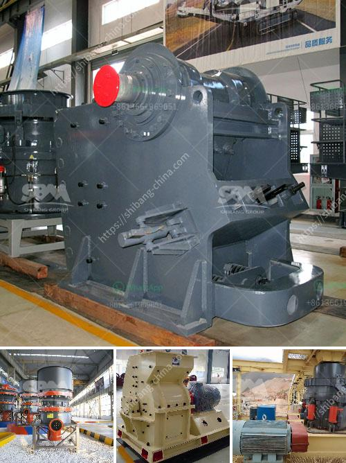

<h3>feldspar ball mills manufacturers</h3>
Feldspar, a mineral widely used in the manufacturing industry, is derived from igneous rocks such as basalt and granite. These rocks are primarily composed of feldspar, quartz, mica, and amphibole minerals, which form an interlocking crystalline structure. The molecular composition of feldspar varies depending on the specific type, resulting in different physical and chemical properties.

Feldspar is a major component in the production of ceramics, glass, paint, and various building materials. It acts as a fluxing agent, reducing the melting temperature of the raw materials and improving the flow in the manufacturing process. Consequently, feldspar is ground into a fine powder before being used in these industries, and ball mills are the most commonly used equipment for grinding.

Ball mills are predominantly used for single-stage fine grinding and have been extensively used in the production of ceramics, paints, and pigments, among others. This grinding method is relatively energy-efficient and allows for a high degree of control over the final product's particle size distribution. Manufacturers have developed various types of ball mills to suit different grinding requirements.

When it comes to feldspar ball mills manufacturers, there are numerous options available in the market. These manufacturers strive to produce reliable, efficient, and high-quality ball mills to meet the demands of their customers. They employ advanced technology and innovative designs to ensure the best performance and productivity.

One such manufacturer is ABC Company, renowned for its state-of-the-art ball mills designed specifically for grinding feldspar. ABC Company's ball mills combine robust construction with advanced features to deliver exceptional performance in terms of grinding efficiency and output quality. These mills are equipped with powerful motors, precision bearings, and advanced control systems, allowing for smooth operation and precise control over the process variables.

Another prominent player in the field is XYZ Corporation, known for its wide range of ball mills suitable for grinding feldspar. XYZ Corporation's ball mills are designed to cater to different processing needs, from small-scale laboratory grinding to large-scale production. These mills are equipped with wear-resistant liners, variable-speed drives, and user-friendly controls, ensuring reliable operation and optimum grinding performance.

In conclusion, feldspar ball mills manufacturers play a crucial role in the manufacturing industry by providing reliable grinding solutions for the efficient production of ceramic, glass, paint, and other materials. These manufacturers employ advanced technology and innovative designs to meet the specific needs and requirements of their customers. As the demand for feldspar continues to grow, these manufacturers will continue to enhance their ball mills, ensuring improved efficiency, productivity, and quality in the manufacturing process.
<h3>Contact us</h3><ul><li><strong>Whatsapp:&nbsp;<a href="https://wa.me/8613661969651">+8613661969651</a></strong></li><li><a href="https://swt.shibang-china.com/?git&amp;zhl&amp;feldspar ball mills manufacturers"><strong>Online Service(chat now)</strong></a></li></ul><h3>Related</h3><ul><li><a href='bauxite crusher manufacturer.md'>bauxite crusher manufacturer</a></li><li><a href='stamp mill for sale in south africa.md'>stamp mill for sale in south africa</a></li><li><a href='enquiry about cone crusher.md'>enquiry about cone crusher</a></li><li><a href='project proposal on funding gold mining.md'>project proposal on funding gold mining</a></li><li><a href='raymond grinder mill pakistan.md'>raymond grinder mill pakistan</a></li></ul>