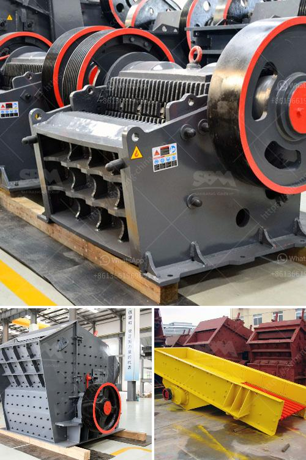

<h3>feldspar crusher manufacturer</h3>
Feldspar is the most abundant mineral on the earth's crust. It has various applications and is widely used in the construction, ceramics, and glass industries. With the increasing demand for feldspar, the mining and processing of this mineral have become more important. In this article, we will discuss the role of a feldspar crusher manufacturer in the processing of feldspar.

A feldspar crusher is a machine that crushes feldspar blocks into smaller pieces for further processing. The machine works by using compressive force to crush the rocks and reduce their size. As a professional feldspar crusher manufacturer, we provide high-quality feldspar crusher machines according to customers' specific requirements.

One of the main advantages of our feldspar crusher machines is their high efficiency. The machines are designed to process feldspar with high efficiency while consuming less energy. This allows our customers to reduce their production costs while increasing their productivity. Additionally, the machines are equipped with advanced technologies that ensure a smooth and reliable operation.

Another advantage of our feldspar crusher machines is their versatility. Our machines can process various types of feldspar, including orthoclase, plagioclase, and microcline. This allows our customers to produce different types of feldspar products for various applications. Whether it is for the construction industry or the ceramics industry, our crusher machines are capable of meeting the diverse needs of our customers.

Furthermore, as a reputable feldspar crusher manufacturer, we take great pride in the quality of our products. We use high-quality materials and components to manufacture our machines. Additionally, our machines undergo strict quality control measures to ensure their durability and reliability. This ensures that our customers receive a reliable and long-lasting feldspar crusher that meets their needs.

In addition to manufacturing high-quality feldspar crusher machines, we also provide excellent after-sales service. We offer comprehensive technical support to our customers, including installation, maintenance, and troubleshooting. Our team of experienced technicians is ready to assist our customers in solving any problems they may encounter during the operation of our machines. Our goal is to ensure the satisfaction of our customers and to build long-term relationships with them.

In conclusion, a feldspar crusher manufacturer plays a crucial role in the processing of feldspar. Their machines are designed to efficiently crush feldspar blocks into smaller pieces, catering to the specific needs of various industries. With their high efficiency, versatility, and reliability, these machines are essential for any feldspar processing operation. As a reputable feldspar crusher manufacturer, we are committed to providing high-quality products and excellent after-sales service to our customers.
<h3>Contact us</h3><ul><li><strong>Whatsapp:&nbsp;<a href="https://wa.me/8613661969651">+8613661969651</a></strong></li><li><a href="https://swt.shibang-china.com/?git&amp;zhl&amp;feldspar crusher manufacturer"><strong>Online Service(chat now)</strong></a></li></ul><h3>Related</h3><ul><li><a href='prices of small gold processing machine.md'>prices of small gold processing machine</a></li><li><a href='hammer mills for mining.md'>hammer mills for mining</a></li><li><a href='used stone crushers dealer.md'>used stone crushers dealer</a></li><li><a href='south africa limestone crushing and blending plant.md'>south africa limestone crushing and blending plant</a></li><li><a href='roller raymond mill.md'>roller raymond mill</a></li></ul>