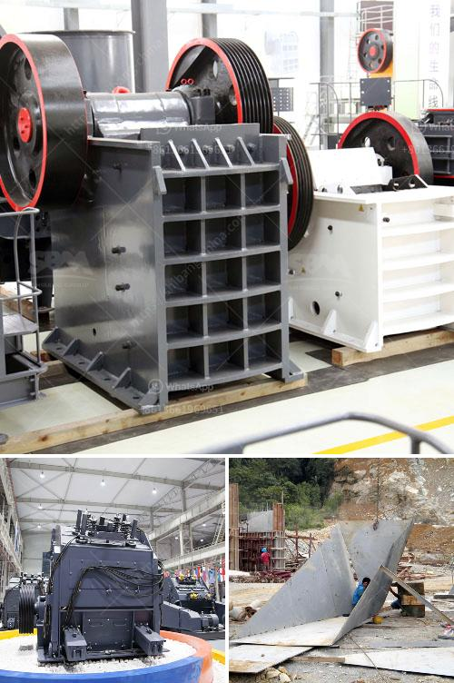

<h3>feldspar crusher unit</h3>
Feldspar is a common mineral found in igneous, sedimentary, and metamorphic rocks. It is widely used in various industries such as glassmaking, ceramics, and construction. To extract feldspar minerals from rocks, the first step is to crush them into smaller particles through a feldspar crusher unit.

A feldspar crusher unit consists of jaw crusher, cone crusher, impact crusher and belt conveyor. These machines work together to process the feldspar ore into required sizes. The crushed feldspar particles are then transported to the vibrating screen for separation. Vibrating screens separate the materials into different sizes according to their particle size. The sized feldspar particles are then sent to the final crushing stage, where a cone crusher further crushes them into finer particles.

The feldspar crusher unit is designed with different crushing chambers tailored to the specific requirements of customers. This ensures that the final product is of high quality and meets the desired specifications. Additionally, the unit is equipped with advanced technology and automation systems that enable efficient and reliable operation.

Apart from the size reduction process, the feldspar crusher unit also plays a crucial role in removing impurities from the ore. Impurities such as iron oxides, mica, and other minerals are often present in feldspar deposits. By crushing the ore, these impurities can be effectively separated and removed, resulting in a purer and higher-grade feldspar product.

In conclusion, a feldspar crusher unit is an essential machine in the mining and processing of feldspar minerals. It not only reduces the size of the ore to facilitate further processing but also removes impurities to obtain a higher-grade product. With its advanced technology and reliable performance, the feldspar crusher unit is a valuable investment for any feldspar processing operation.
<h3>Contact us</h3><ul><li><strong>Whatsapp:&nbsp;<a href="https://wa.me/8613661969651">+8613661969651</a></strong></li><li><a href="https://swt.shibang-china.com/?git&amp;zhl&amp;feldspar crusher unit"><strong>Online Service(chat now)</strong></a></li></ul><h3>Related</h3><ul><li><a href='stone crushing process.md'>stone crushing process</a></li><li><a href='buy a cement blending plant in south africa.md'>buy a cement blending plant in south africa</a></li><li><a href='silica sand machinery manufacturer from india.md'>silica sand machinery manufacturer from india</a></li><li><a href='granite quarry crusher equipment.md'>granite quarry crusher equipment</a></li><li><a href='ball mill feed spout seal.md'>ball mill feed spout seal</a></li></ul>