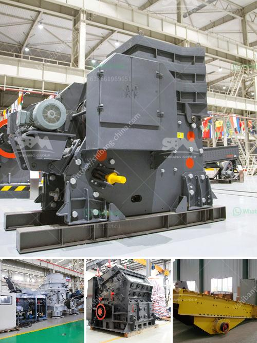

<h3>feldspar grinding machine</h3>
Feldspar grinding machine is a powerful milling machine used to grind the fine powder or micro powder from the feldspar rock. The feldspar grinding machine for sale is the result of our technical experts' effort in developing innovative and efficient grinding equipment. Nowadays, our feldspar grinding machine includes trapezium grinding mill, vertical mill, Raymond mill, ball mill, and so on.

The feldspar grinding machine has the features of high efficiency, environmental protection, and low energy consumption. Feldspar grinding plant has wide application in the milling industry and chemical industry, and has a significant role in the industrial production. Feldspar can be used as raw materials for various industries, such as glass, ceramics, pottery, enamel, abrasive materials, and so on.

The feldspar grinding machine designed by our company are widely used by many quarry operators and were well received by them. Now, our products have been exported to many countries, such as Nigeria, Libya, South Africa, Vietnam, Indonesia, Philippines, Pakistan, Brazil, Egypt, Zambia, etc., and received high popularity.

In the feldspar grinding process, there are several steps to increase the fineness of the feldspar powder. First, crushing and grinding the feldspar block into a smaller size. Second, grading the crushed feldspar particles by sieving. Third, carrying out beneficiation processes to remove impurities from feldspar particles. Fourth, drying the feldspar particles to obtain the required moisture content. Finally, grinding the dried feldspar particles into fine powder.

In conclusion, the feldspar grinding machine provided by our company is a powerful milling machine that can grind the feldspar into fine powder. With the continuous advancement of technology, the feldspar grinding machine also has a broad development space. In addition, our company provides customized services, and we can design and manufacture feldspar grinding machines according to customers' specific requirements, aiming to create greater value for them.
<h3>Contact us</h3><ul><li><strong>Whatsapp:&nbsp;<a href="https://wa.me/8613661969651">+8613661969651</a></strong></li><li><a href="https://swt.shibang-china.com/?git&amp;zhl&amp;feldspar grinding machine"><strong>Online Service(chat now)</strong></a></li></ul><h3>Related</h3><ul><li><a href='coal screening machine for sale in india.md'>coal screening machine for sale in india</a></li><li><a href='rodillos para trituradoras en bogota.md'>rodillos para trituradoras en bogota</a></li><li><a href='rock crusher company.md'>rock crusher company</a></li><li><a href='magnesium sulfate production line equipment.md'>magnesium sulfate production line equipment</a></li><li><a href='indonesia copper processing equipment for sale.md'>indonesia copper processing equipment for sale</a></li></ul>