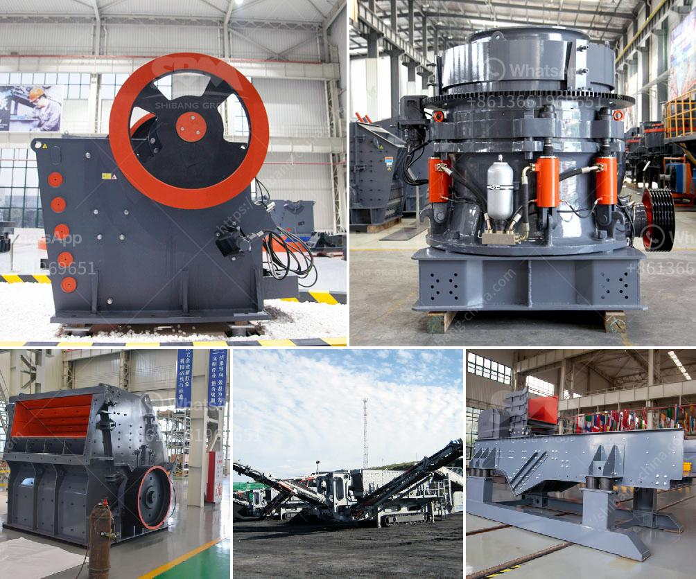

<h3>feldspar grinding mill suppliers india</h3>
Feldspar is the most abundant rock-forming mineral on the earth's crust. It forms the framework of igneous, sedimentary, and metamorphic rocks and is used in various industries, including ceramics, glass, and construction materials. Feldspar can be classified into two main categories - alkali feldspar and plagioclase feldspar.

To process feldspar, grinding mill is widely used in the industry. There are many suppliers of grinding mill in India and other countries. Among those suppliers, the decision of choosing a suitable grinding mill can be a daunting task. However, there are some key factors that one should consider before purchasing a feldspar grinding mill.

Firstly, the quality and reliability of the supplier are of utmost importance. A reputable supplier will ensure that their grinding mills are made from high-quality materials, ensuring durability and long-term performance. It is advisable to do thorough research and check for customer reviews and testimonials to gauge the supplier's credibility.

Secondly, the grinding mill's capacity and efficiency should be considered. This will depend on the specific requirements of the industry and the scale of operations. If a large quantity of feldspar needs to be processed, a grinding mill with high capacity and efficiency will be required. It is recommended to consult with the supplier to determine the most suitable grinding mill for the specific requirements.

Furthermore, the maintenance and after-sales support provided by the supplier should also be taken into consideration. A reliable supplier will offer comprehensive technical support, including installation, training, and troubleshooting services. Regular maintenance and timely availability of spare parts are essential for maximizing the lifespan and performance of the grinding mill.

Cost is another crucial factor to consider when choosing a feldspar grinding mill supplier. Different suppliers may offer varying prices for their products. It is important to compare prices from different suppliers and consider the overall value for money, taking into account the quality, efficiency, and after-sales support provided.

In India, there are several reputable suppliers of feldspar grinding mills. These suppliers offer a wide range of grinding mills, catering to different industries and customer requirements. Some well-known suppliers include Techno Designs, Ecutec India Private Limited, and Laxmi Group. These suppliers have a track record of providing high-quality grinding mills and excellent customer service.

In conclusion, when looking for a feldspar grinding mill supplier in India or any other country, it is crucial to consider factors such as quality, capacity, efficiency, maintenance, after-sales support, and cost. Making an informed decision based on these factors will help ensure that the chosen grinding mill meets the specific requirements and provides optimal performance.
<h3>Contact us</h3><ul><li><strong>Whatsapp:&nbsp;<a href="https://wa.me/8613661969651">+8613661969651</a></strong></li><li><a href="https://swt.shibang-china.com/?git&amp;zhl&amp;feldspar grinding mill suppliers india"><strong>Online Service(chat now)</strong></a></li></ul><h3>Related</h3><ul><li><a href='crusher stone crusher 1 ton peru.md'>crusher stone crusher 1 ton peru</a></li><li><a href='cost of a medium size stone crusher.md'>cost of a medium size stone crusher</a></li><li><a href='komatsu crawler jaw crusher.md'>komatsu crawler jaw crusher</a></li><li><a href='mining equipment made in germany.md'>mining equipment made in germany</a></li><li><a href='used clay grinding machine for sale.md'>used clay grinding machine for sale</a></li></ul>