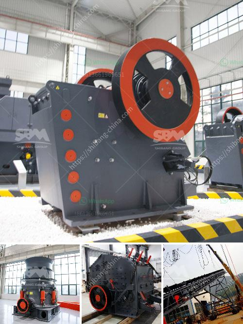

<h3>fintec mobile screens for sale australia</h3>
In today's fast-paced world, businesses are constantly searching for ways to streamline their operations and improve their overall efficiency. The financial technology (fintech) sector is no exception. One key area where fintech companies can significantly enhance their productivity is through the use of mobile screens. These portable devices offer a range of benefits, including convenience, flexibility, and real-time access to critical information. In Australia, there is a growing demand for fintec mobile screens, providing businesses with an excellent opportunity to boost their operations.

One of the primary advantages of using mobile screens is their portability. These devices are compact and lightweight, allowing users to take them anywhere and set them up quickly. Whether a financial adviser needs to conduct a presentation at a client's office or an executive needs to access financial data during a business trip, mobile screens make it easy to access information on the go. This convenience enhances efficiency by eliminating the need to rely on bulky and cumbersome equipment or delay important tasks due to limited access to data.

Furthermore, fintec mobile screens offer flexibility. They can be easily connected to smartphones, tablets, or laptops, allowing for seamless integration with existing devices. This versatility enables professionals to work across multiple platforms and access information from various sources, ensuring they have all the necessary data at their fingertips. For example, a financial analyst can utilize a mobile screen to display real-time stock and market data, facilitating informed decision-making. Additionally, with wireless connectivity options, professionals can collaborate with teammates or clients, enhancing teamwork and communication.

Real-time access to critical information is crucial for fintech companies. Whether it's tracking financial market updates, monitoring portfolio performance, or analyzing customer data, having real-time data can provide a competitive edge. Mobile screens enable professionals to view information as it happens, ensuring they are always up-to-date with the latest developments. This immediacy allows businesses to respond quickly to market changes, make informed decisions, and seize new opportunities without any delays. With fintec mobile screens, professionals can monitor data in real-time, improving the accuracy and timeliness of their analyses and projections.

For businesses in Australia, the availability of fintec mobile screens is on the rise. Numerous reputable vendors offer a wide range of options suitable for various needs, budgets, and preferences. When selecting mobile screens, businesses should consider factors such as screen size, resolution, connectivity options, and battery life. Assessing these features will ensure that the chosen device aligns with the specific requirements and objectives of the business.

In conclusion, fintec mobile screens offer substantial benefits for businesses in Australia. Their portability, flexibility, and real-time access to critical information significantly enhance efficiency and productivity. With the increasing availability of mobile screens in the country, businesses have a fantastic opportunity to leverage these tools to optimize their operations. By investing in fintec mobile screens, Australian fintech companies can stay at the forefront of innovation, improve their decision-making process, and capitalize on emerging market opportunities.
<h3>Contact us</h3><ul><li><strong>Whatsapp:&nbsp;<a href="https://wa.me/8613661969651">+8613661969651</a></strong></li><li><a href="https://swt.shibang-china.com/?git&amp;zhl&amp;fintec mobile screens for sale australia"><strong>Online Service(chat now)</strong></a></li></ul><h3>Related</h3><ul><li><a href='small ball mill for sale zimbabwe.md'>small ball mill for sale zimbabwe</a></li><li><a href='aggregate washing machine cost.md'>aggregate washing machine cost</a></li><li><a href='bentonite granules making machinery india.md'>bentonite granules making machinery india</a></li><li><a href='aggregate crushing plant and processing.md'>aggregate crushing plant and processing</a></li><li><a href='stone jaw crusher.md'>stone jaw crusher</a></li></ul>