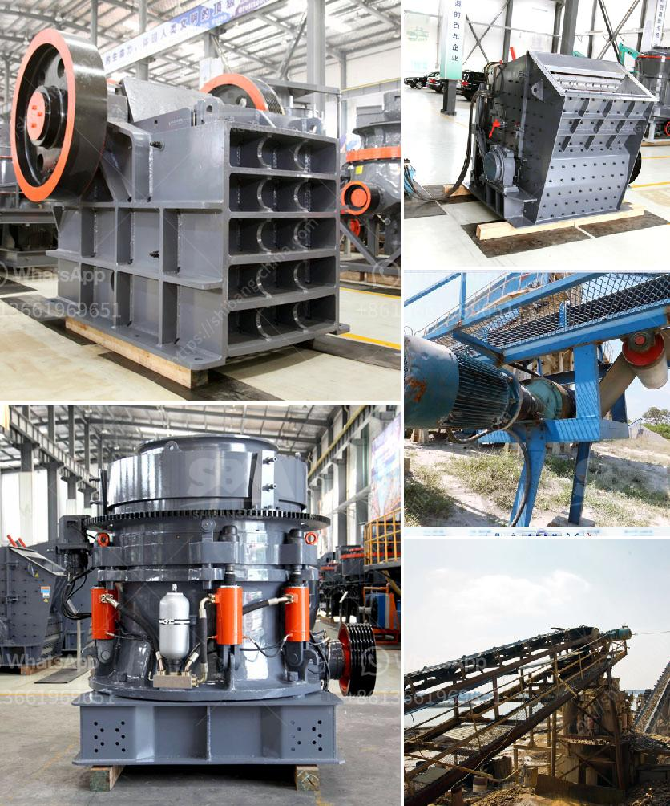

<h3>fly ash grinding machine manufacturar in india</h3>
Fly ash, also known as pulverized fuel ash, is a byproduct of coal combustion, composed of fine particles that are driven out of the boiler along with flue gases. In recent years, with the increasing demand for energy and the rapid development of the coal industry in India, fly ash has become a significant environmental challenge. However, this challenge can be transformed into a valuable opportunity, thanks to fly ash grinding machines manufactured in India.

Fly ash grinding machines are used to grind fly ash into fine particles for utilization in various applications such as making cement, filling or reclamation of land, stabilization of soil, and in agriculture. These machines help in dust control and achieve higher productivity levels.

One of the leading manufacturers of fly ash grinding machines in India is Laxmi En-Fab Pvt. Ltd. This company offers premium quality machines that are used to grind fly ash into fine particles. The machines are designed to achieve efficient and uniform grinding of fly ash. They utilize high-quality components and advanced technology to ensure durability and reliability. Moreover, the machines are easy to operate, require low maintenance, and have a long service life.

Laxmi En-Fab's fly ash grinding machines are suitable for grinding various types of fly ash such as pond ash, bottom ash, and coal ash. The machines have a high grinding efficiency and can produce different particle sizes based on the specific requirements of the customers. Additionally, these machines have a robust construction and are resistant to wear and tear, ensuring a long-term investment for the customers.

Another prominent manufacturer of fly ash grinding machines in India is Techno Enterprise. This company offers a wide range of grinding machines that are suitable for grinding fly ash, as well as other materials such as clinker, limestone, and gypsum. The machines are designed to achieve precise grinding and can produce different particle sizes with high accuracy. Techno Enterprise's fly ash grinding machines are known for their energy efficiency and low operating costs. They are also equipped with advanced features such as automatic feeding and discharge systems, ensuring a seamless grinding process.

The Indian government has been promoting the utilization of fly ash in various industries to reduce environmental pollution and waste. The utilization of fly ash not only helps in waste management but also contributes to sustainable development. The availability of efficient and reliable fly ash grinding machines manufactured in India has played a significant role in promoting the utilization of fly ash and has opened up new avenues for its application.

In conclusion, fly ash grinding machines manufactured in India have revolutionized the process of utilizing fly ash. These machines offer efficient grinding, high productivity, and superior particle size control. They are designed to meet the specific requirements of customers and contribute to sustainable development. With the increasing demand for fly ash utilization, the manufacturers in India are continuously innovating and improving their machines to meet the evolving needs of the market.
<h3>Contact us</h3><ul><li><strong>Whatsapp:&nbsp;<a href="https://wa.me/8613661969651">+8613661969651</a></strong></li><li><a href="https://swt.shibang-china.com/?git&amp;zhl&amp;fly ash grinding machine manufacturar in india"><strong>Online Service(chat now)</strong></a></li></ul><h3>Related</h3><ul><li><a href='gypsum making machinery.md'>gypsum making machinery</a></li><li><a href='vibrating screen for sale philippines.md'>vibrating screen for sale philippines</a></li><li><a href='100tph raw mill specification.md'>100tph raw mill specification</a></li><li><a href='used gold ore processing equipment for sale.md'>used gold ore processing equipment for sale</a></li><li><a href='mobile rock crusher.md'>mobile rock crusher</a></li></ul>