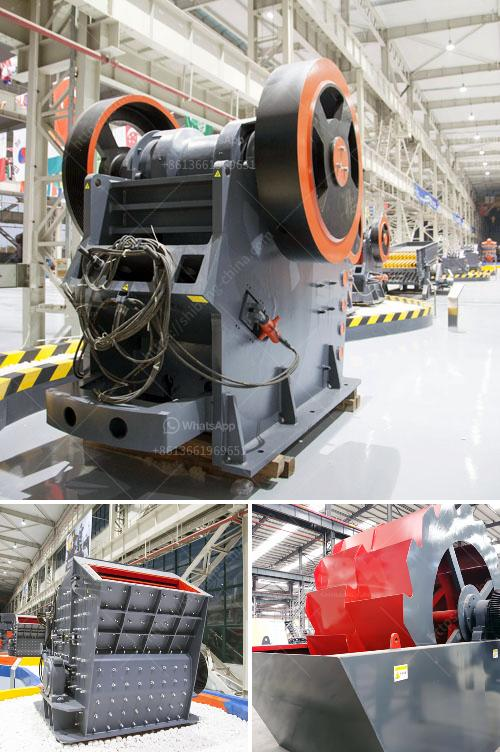

<h3>for sale rock crushing tons</h3>
Rock crushing is a crucial process in many industries that deal with aggregate material. These industries, including construction, mining, and demolition, require highly efficient and reliable rock crushing equipment to break down larger rocks into smaller, more manageable sizes. To meet this demand, there are various rock crushing tons available for sale in the market.

Rock crushing tons, also known as rock crushers, are heavy-duty machines designed to crush large rocks into smaller particles effectively. They are equipped with strong jaws or crushing plates that exert enormous force to break down the rocks. The crushed rocks can then be used for various purposes, such as constructing roads, manufacturing concrete, or producing building materials.

When considering purchasing rock crushing tons, several factors must be taken into account. Firstly, the capacity of the machine, measured in tons per hour, is a vital consideration. Different models offer different crushing capacities. It is essential to select a machine that can handle the specific demands of your industry with ease.

Another critical factor is the level of automation and control offered by the rock crushing tons. Advanced models come equipped with modern features like remote monitoring, computerized control systems, and real-time data tracking. These features enhance the efficiency of the crushing process and enable operators to optimize machine settings and monitor performance accurately.

Additionally, the durability and reliability of the equipment are crucial. Rock crushing tons are subjected to heavy loads, intense vibrations, and harsh conditions. Therefore, it is vital to choose a machine constructed with high-quality materials and robust components to ensure long-lasting performance even in the toughest environments.

Overall, investing in rock crushing tons can greatly benefit industries that require efficient and cost-effective rock crushing. These machines enhance productivity, reduce manual labor, and ensure consistent quality of the crushed material. Nevertheless, careful consideration of capacity, automation, and durability is essential when choosing the right rock crushing tons for your specific needs. With the right equipment, businesses can significantly improve their operations and maximize profit potential.
<h3>Contact us</h3><ul><li><strong>Whatsapp:&nbsp;<a href="https://wa.me/8613661969651">+8613661969651</a></strong></li><li><a href="https://swt.shibang-china.com/?git&amp;zhl&amp;for sale rock crushing tons"><strong>Online Service(chat now)</strong></a></li></ul><h3>Related</h3><ul><li><a href='how to make talcum powder in the escapists.md'>how to make talcum powder in the escapists</a></li><li><a href='copper ore concentrator price.md'>copper ore concentrator price</a></li><li><a href='types of equipments used in cement industry.md'>types of equipments used in cement industry</a></li><li><a href='price quarry stone crusher.md'>price quarry stone crusher</a></li><li><a href='quarry crusher equipment manufacturer in germany.md'>quarry crusher equipment manufacturer in germany</a></li></ul>