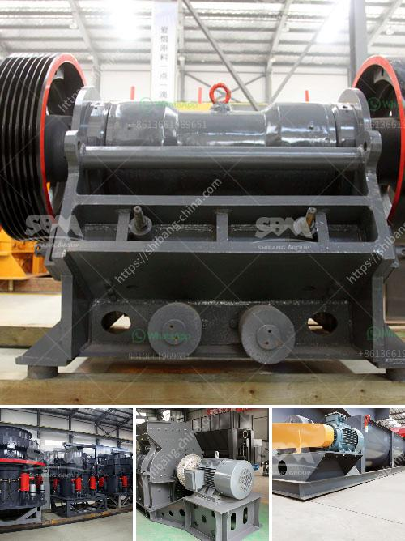

<h3>four roller mill</h3>
The four roller mill is a versatile and widely used milling machine that can be used for both the grinding and dispersing of various materials. It is commonly used in the production of paints, inks, cosmetics, food processing, and pharmaceuticals.

The mill consists of four horizontally arranged rollers, each with a specific function. These rollers can be adjusted independently to achieve the desired particle size and grinding intensity. The material to be processed is fed into the center of the mill and is subjected to a series of compressive and shear forces as it passes through the gap between the rollers.

One of the key advantages of the four roller mill is its ability to produce a consistent and uniform particle size distribution. This is achieved through the precise control of the roller gap, which can be easily adjusted to meet the desired specifications. This ensures that the end product is of high quality and meets the required standards.

Another advantage of the four roller mill is its high throughput capacity. The four rollers rotate at different speeds, which enhances the grinding efficiency and allows for a higher material flow rate. This results in a higher production rate and increased productivity for the operator.

Furthermore, the four roller mill is relatively easy to operate and maintain. The design of the machine allows for quick and easy roller changes, minimizing downtime and maximizing production efficiency. The rollers are also easy to clean, reducing the risk of contamination and ensuring the purity of the final product.

In conclusion, the four roller mill is a versatile and efficient milling machine that offers numerous benefits for various industries. Its ability to produce a consistent particle size distribution, high throughput capacity, and ease of operation and maintenance make it a popular choice among manufacturers. Whether in the production of paints, inks, cosmetics, food processing, or pharmaceuticals, the four roller mill is a reliable and indispensable tool for achieving optimal results.
<h3>Contact us</h3><ul><li><strong>Whatsapp:&nbsp;<a href="https://wa.me/8613661969651">+8613661969651</a></strong></li><li><a href="https://swt.shibang-china.com/?git&amp;zhl&amp;four roller mill"><strong>Online Service(chat now)</strong></a></li></ul><h3>Related</h3><ul><li><a href='roll mills supplier in karachi.md'>roll mills supplier in karachi</a></li><li><a href='komatsu crawler jaw crusher.md'>komatsu crawler jaw crusher</a></li><li><a href='hammer mill gauteng.md'>hammer mill gauteng</a></li><li><a href='hammer mill 40 ton hour.md'>hammer mill 40 ton hour</a></li><li><a href='stamp mill for sale in south africa.md'>stamp mill for sale in south africa</a></li></ul>