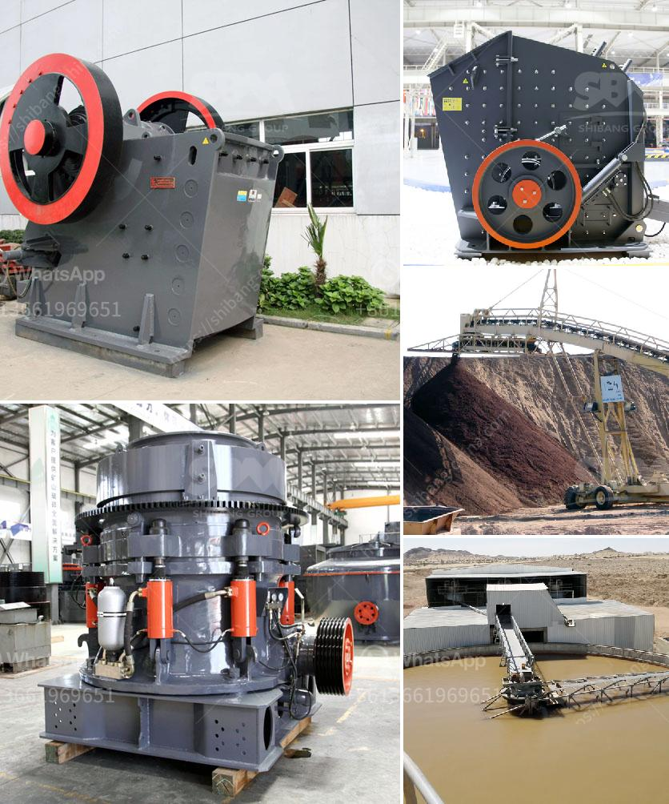

<h3>france roller mills</h3>
France, a country renowned for its culinary prowess and rich gastronomic heritage, is not only known for its delectable cuisine but also for its contribution to the world of milling. Among the various milling techniques, France Roller Mills have earned a special place in the industry, thanks to their consistency, precision, and innovative approach.

Roller milling, a technique developed in the late 19th century, revolutionized the way grains are processed, extracting nutritious components while removing unwanted impurities. France, being one of the leading grain-producing countries in Europe, embraced this method with open arms, leading to the establishment of numerous roller mills across the country.

What sets France Roller Mills apart is their commitment to quality. From the selection of grains to the final product, every step is meticulously monitored to ensure exceptional results. The mills employ advanced technologies and modern machinery, which facilitate high-speed processing without compromising the integrity of the grains. This results in flour that is finer, purer, and boasts enhanced nutritional value. 

One of the key advantages of roller milling is its versatility. France Roller Mills can be used to process a wide range of grains, including wheat, maize, rye, barley, and more. This flexibility allows millers to cater to the diverse needs of their clients, whether it be in the production of bread, pastries, pasta, or other grain-based products. The consistent quality of the flour produced by these mills has made it a preferred choice for chefs, bakers, and consumers alike, both in France and abroad.

Furthermore, France Roller Mills are at the forefront of technological advancements in the milling industry. Constant research and development efforts enable them to explore new techniques, improve efficiency, and reduce the environmental impact of their operations. The mills integrate sustainability practices, such as the use of renewable energy sources and the implementation of waste management systems, which make them pioneers in responsible milling practices.

The legacy of France Roller Mills is not only about their commitment to quality and innovation but also their contribution to the local economy. These mills have provided employment opportunities for generations, boosting rural economies and supporting local communities. Many of these family-owned mills have been passed down through generations, each preserving the traditional techniques while embracing modern technology.

In recent years, France Roller Mills have also witnessed a resurgence in interest from artisanal bakers and consumers seeking organic and locally-sourced products. The mills cater to this demand by collaborating with farmers who practice sustainable agriculture and supply them with premium, GMO-free grains. This collaboration fosters a sense of trust and transparency between the millers and farmers, ensuring that only the best ingredients are used in the milling process.

In conclusion, France Roller Mills are a testament to the country's commitment to excellence in milling. The mills' dedication to quality, innovation, and sustainability has earned them a prominent place in the industry, with their products being highly regarded both locally and internationally. These mills not only produce exceptional flour but also play a significant role in supporting the local economy and preserving traditional milling techniques. France Roller Mills stand as an epitome of the fine craftsmanship and culinary heritage that France is renowned for.
<h3>Contact us</h3><ul><li><strong>Whatsapp:&nbsp;<a href="https://wa.me/8613661969651">+8613661969651</a></strong></li><li><a href="https://swt.shibang-china.com/?git&amp;zhl&amp;france roller mills"><strong>Online Service(chat now)</strong></a></li></ul><h3>Related</h3><ul><li><a href='small quartz appratus for crushing.md'>small quartz appratus for crushing</a></li><li><a href='ton day cement clinker grinding plant.md'>ton day cement clinker grinding plant</a></li><li><a href='thailand for stone crusher plant.md'>thailand for stone crusher plant</a></li><li><a href='ball mill manufacturer in philippines.md'>ball mill manufacturer in philippines</a></li><li><a href='cement concrete crusher equipment.md'>cement concrete crusher equipment</a></li></ul>