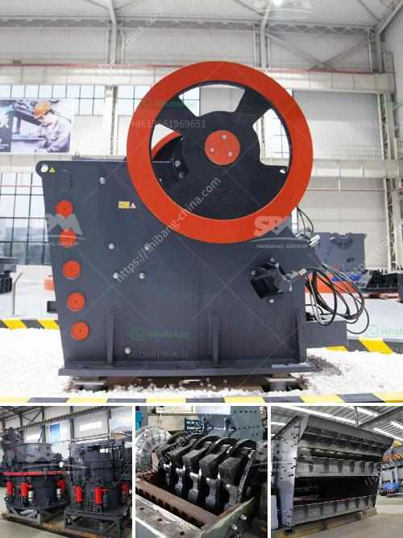

<h3>fuel plant stone crusher</h3>
A stone crushing plant is primarily involved in the manufacture of aggregates of various sizes (coarse aggregates, crusher run, rock sand and other fine aggregates) from basalt boulders. Coarse aggregates are usually used in ready mix concrete and asphaltic concrete. Crusher run is used for the bases and sub-bases for road making.

Fine aggregates are used for the production of concrete and plastering. The processes involved in stone crushing include pre-processing, crushing, washing, screening, and recycling of wastewater.

Pre-processing consists of removal of stone boulders by mechanical means, feeding into jaw crusher, screening, and then the required size of crushed stone is obtained by pre-screening. Crushing is done by a jaw crusher.

The stone crusher plant is powered by PLCs (Programmable logic controllers) which handle all the operations of the crushing process. As the name suggests, PLCs automatically execute a sequence of operations with minimal human intervention. This ensures maximum productivity while minimizing the risk of human error.

The stone crusher plant is also equipped with an integrated water sprinkler system that helps in reducing the dust and pollution caused by the crushing process. The sprinkler system ensures that water is sprayed uniformly on the crushed stones, which cools them down and reduces their airborne dust particles.

Furthermore, the stone crusher plant also includes a fuel storage tank and a fuel supply system. The fuel storage tank stores the fuel required for the generator set to power the PLCs and other electrical components of the crushing plant. The fuel supply system ensures that the generator set is continuously supplied with fuel to keep the plant running smoothly.

The stone crusher plant is typically equipped with a primary and secondary crusher, both of which require fuel to operate. The primary crusher consumes around 40 liters of fuel per hour, while the secondary crusher consumes around 50 liters of fuel per hour, resulting in an average fuel consumption of 100 liters per hour.

The fuel consumption of the stone crusher plant is influenced by many factors, including the stone hardness, moisture content, type of fuel used, presence of dust particles in the air, and the required size of the finished product.

The stone crusher plant is a great investment opportunity for builders and contractors who are looking to set up a fuel-efficient crushing facility. The plant is capable of crushing a wide variety of stones, including granite, basalt, limestone, river pebble, and so on.

In conclusion, a stone crusher plant is a lucrative investment opportunity for small-scale entrepreneurs with limited capital. The plant is especially suitable for road construction projects, railway construction projects, and other construction projects that require high-quality aggregates. With the integrated water sprinkler system, the plant also contributes to minimizing environmental pollution caused by the crushing process.
<h3>Contact us</h3><ul><li><strong>Whatsapp:&nbsp;<a href="https://wa.me/8613661969651">+8613661969651</a></strong></li><li><a href="https://swt.shibang-china.com/?git&amp;zhl&amp;fuel plant stone crusher"><strong>Online Service(chat now)</strong></a></li></ul><h3>Related</h3><ul><li><a href='marble crusher machine in rajasthan.md'>marble crusher machine in rajasthan</a></li><li><a href='crusher unit price in kerala.md'>crusher unit price in kerala</a></li><li><a href='components for cone crusher major.md'>components for cone crusher major</a></li><li><a href='sale of ball mills used in peru.md'>sale of ball mills used in peru</a></li><li><a href='300tpd cement plant cost in india.md'>300tpd cement plant cost in india</a></li></ul>