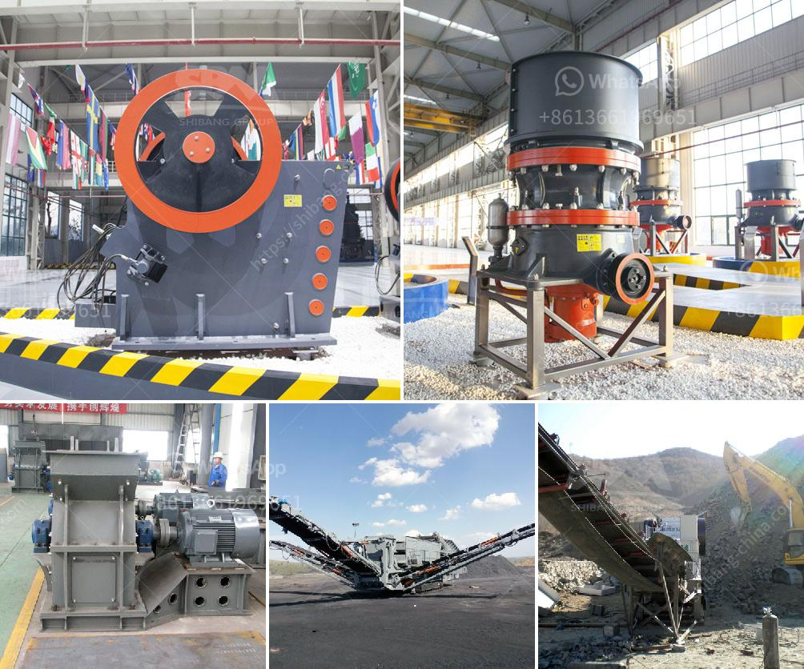

<h3>fujian mill machinery plant</h3>
The Fujian Mill Machinery Plant is a leading manufacturer and supplier of mill machinery equipment in the province of Fujian, China. With decades of experience in the industry, the plant has earned a reputation for its high-quality products and excellent customer service.

Established in the early 1980s, the Fujian Mill Machinery Plant was founded with the vision of providing reliable and efficient machinery for the milling industry. Over the years, the plant has grown from a small workshop to a state-of-the-art manufacturing facility, equipped with the latest technology and machinery.

One of the key factors contributing to the success of the Fujian Mill Machinery Plant is its commitment to innovation. The plant continuously invests in research and development, focusing on improving the efficiency and performance of its machinery. This dedication to innovation has resulted in the development of cutting-edge equipment that meets the evolving needs of the milling industry.

The range of machinery manufactured by the Fujian Mill Machinery Plant is diverse and caters to various milling processes. From rice mills to flour mills, the plant produces equipment that can handle different grains with precision and care. The machinery is designed to ensure maximum yield and minimal wastage, helping mill owners optimize their operations and increase profitability.

In addition to its wide range of machinery, the Fujian Mill Machinery Plant also offers comprehensive after-sales services. The plant has a dedicated team of technicians and engineers who are available for installation, maintenance, and repair services. This commitment to customer support has earned the plant a loyal clientele who value the reliability and efficiency of the machinery, as well as the professional and efficient service provided by the team.

Furthermore, the Fujian Mill Machinery Plant is certified for its quality management system, adhering to international standards such as ISO 9001:2015. This certification ensures that the plant follows strict quality control measures in all aspects of its operations, from design to manufacturing. This commitment to quality has made the plant a trusted name in the industry, both domestically and internationally.

The Fujian Mill Machinery Plant takes pride in its contribution to the milling industry, providing reliable and efficient machinery that meets the demands of mill owners worldwide. With its focus on innovation, commitment to quality, and excellent customer support, the plant has positioned itself as a market leader in the field. As the industry continues to evolve, the Fujian Mill Machinery Plant remains dedicated to staying at the forefront of technological advancements, ensuring that its customers have access to the best machinery for their milling needs.
<h3>Contact us</h3><ul><li><strong>Whatsapp:&nbsp;<a href="https://wa.me/8613661969651">+8613661969651</a></strong></li><li><a href="https://swt.shibang-china.com/?git&amp;zhl&amp;fujian mill machinery plant"><strong>Online Service(chat now)</strong></a></li></ul><h3>Related</h3><ul><li><a href='crusher stone price bolivia.md'>crusher stone price bolivia</a></li><li><a href='ball mill manufacturer in philippines.md'>ball mill manufacturer in philippines</a></li><li><a href='horizontal grinding mills price.md'>horizontal grinding mills price</a></li><li><a href='stone crusher plant price in india.md'>stone crusher plant price in india</a></li><li><a href='how to make talcum powder in the escapists.md'>how to make talcum powder in the escapists</a></li></ul>